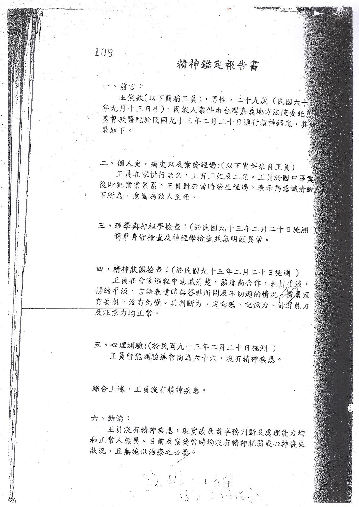

# 2016台灣死刑判決報告
**10位精障死刑犯之判決分析**

**A Review of the Death Penalty Judgments in Taiwan (2016)**

=========

# 導讀 盲人騎瞎馬、夜半臨深淵：淺談台灣精障死刑審理與判決的困境

**黃致豪（執業律師、台大心理學研究所博士班）**

台灣廢除死刑推動聯盟（「廢死聯盟」）製作2016年台灣死刑判決報告，整理了十件與精神障礙相關死刑案件的資料，依照一定的架構進行分析，並依據分析所得，製作出這次的報告。

報告本身，可以說是2016年廢死聯盟與法律扶助基金會合辦「2016精障死刑判決工作坊」研討過程的進一步分析。

## 精障者在身心障礙權利公約內國法化之後……

透過「施行法」這種立法技術，台灣在2009年將公民與政治權利公約以及經濟社會文化權利國際公約（一般合稱「兩公約」）加以內國法化，賦予兩公約的內容在我國也至少具備一般法律位階以上的效力（至於有無比法律更高的效力，學說實務上還有不同意見），也在近年來漸漸透過各種配套措施與外部審查，告訴國民與國際社會：台灣確實透過具體的行動，在實踐兩公約。或許也是因為如此，無論法律人與否，漸漸有越來越多人對於「兩公約」可以琅琅上口。

相對於此，比較不為人知的是：台灣其實也是身心障礙者權利公約（CRPD）的簽署國，一樣也透過施行法，把CRPD的內容賦予我國法律上的效力。可惜的是，身心障礙者，尤其是精障者在法律中的困境，並沒有因此而改善。徒法不足自行；只有立了個施行法，沒有配套、沒有實踐、沒有審查，幾乎什麼問題都沒能解決。

其中尤需行政、司法、立法三權與國民共同關照的議題，特別是精神障礙者在司法中的基礎人權保障，除了長期受到忽略之外，更是嚴重的受到扭曲。

特別是對於涉入刑事犯罪的精障者，這樣的扭曲更形明顯。

## 盲人騎瞎馬、夜半臨深淵的雙重困境

在台灣，大多數人似乎一直以來存有對於精障者廣泛的誤解：

「還記得回家的路，還知道要吃飯、上廁所、停摩托車。這哪裏有精神障礙？」事實上，精神障礙的定義未必會與工作/近期記憶或者基本的認知功能有關；有許多嚴重的精神病患的短期記憶與基本認知功能看不出有問題。

「只是憂（躁）鬱症而已，這不是精神障礙吧。」

事實上，依據精神醫學界的診斷準則，情緒疾患（emotional disorder）也是精神障礙的一類，而且嚴重時有扭曲患者現實感與認知功能的可能。

「說有精神障礙，你怎麼知道他不是裝的？」

事實上，當代的精神醫學透過臨床的心理衡鑑工具、病理學上的統計效度分析、以及專業精神衛生工作者的觀察，在絕大多數情況下都可以準確判斷出某個患者是否「詐病」------就別談就算有詐病，大多數也是有病裝沒病的案例居多的狀況了。

「精神障礙者就像是不定時炸彈一樣，好危險。」

事實上，絕大多數的精神障礙者與暴力犯罪或者公共危險並沒有顯著關聯性。

以上幾種反應，都是我們在日常生活中，甚至各式媒體上可能常見的誤解。一言以蔽之，上述的這些反應指出了公民集體對於精神障礙與精障者的形象扭曲與化約：精神障礙，要不是完全失控瘋狂（entirely insane），就是智能嚴重不足；總而言之，在我們貧乏的想像當中，精神障礙者就是不應該有某個面向可以過著一般的生活。

但這樣的化約與想像是錯的，這不僅是誤解，同時也是一種嚴重的社會歧視。

帶著上述這樣的貧乏想像與歧視進入刑事司法，於是我們看到每況愈下的社會論述不斷透過誤解或扭曲精障者的形象與行為，為涉入刑案的精障（或疑似精障）被告，鋪設通往刑場的滑坡。

而辦理這類案件的刑事實務工作者，也往往因為輿論的壓力而無力深入探究在我國憲法、法律以及人權公約的保障架構下，精神障礙者的權益有哪些，應該如何在具體案件之中加以保障，例如：

被告在被逮捕或者接受調查的時候，有「就訊能力」（competence for interview/investigation）嗎？有輔佐人或律師在場協助嗎？以慎刑、節制國家權力為宗旨的刑法在講到「責任能力」（criminal responsibility）內涵時，真的可以用行政法上精神衛生法的觀念來加以理解嗎？刑事訴訟法上的受（就）審能力（competence to stand trial），內涵是什麼，又該如何調查證據？對於被定罪的精障者，在哪些狀況下不應該予以執行刑罰（fitness for execution）？

身為司法實務工作者與司法行為科學研究者，我鮮少看到任何法院有對於上開議題的深入檢討、論述或反思。反而法院為了虛無的「公共安全與社會防衛」想像，不得不對精障犯罪者的生命或自由予以永久剝奪。

這不應是任何一個標榜法治國的民主國家所應樂見的──無論公民在甦醒之前要求對精障被告重罰或永久隔離的聲浪有多麼猛烈。

## 重新檢視刑事司法中的精神障礙：從鑑定的層級化分析入手

當我們在檢視精障者與精神障礙在司法當中的相關議題時，迄今最常被忽視但或許也是最重要的一個關鍵，正是鑑定對於個案與司法刑事政策所可能產生的重大影響：鑑定人與鑑定意見，究竟以何種面目與力道，在影響著每一個有精障議題存在的司法判決？

欲了解這個問題，我們必須有一套系統性的檢視方法，來將每一個鑑定予以解構，讓鑑定的結果及其經過，無論在合法性以及形式與實質的科學性等層面，都可以受到完整的檢視。這正是由我綜合了司法行為科學、司法實務與證據法的見解，在2016年的工作坊當中所提出的檢視架構，我個人則稱之為「鑑定分析的層級化理論」。

本報告的協作夥伴們，在過程中設法利用上開的鑑定分析層級架構來針對每一個個案檢視：個案中對於精障被告進行的刑事訴訟程序是否正當無瑕疵？因而做成的罪責判斷是否合乎法律與科學原則？[^1]

分析現況的結果，都呈現在這份報告當中。各位會看到這些結論並不令人滿意，特別是對於一個自我標榜為現代化司法的民主法治國家來說。

但至少有了這樣的問題意識之後，我們可以漸漸的面對每一個涉及精障者與精障議題的個案，試圖更深入討論現代公民社會是如何在司法體系當中對待精障者與相關議題。

==========

# 前言 2016台灣死刑判決報告：10位精障死刑犯之判決分析

**台灣廢除死刑推動聯盟**

台灣廢除死刑推動聯盟於2015年提出了《台灣死刑判決報告：75位死刑犯判決綜合分析》，該次報告在整體性地考察台灣本土的死刑判決之後，發現死刑判決遠遠不是大眾一廂情願認定的「罪證確鑿」、「惡行重大才判死刑」，反而時常出現違反法學理論、違反國際公約、違反正當程序、或違反邏輯的論理。

而在這當中，與「精神障礙」有關的死刑個案又特別引人關注及討論。譬如，於死刑的個案及判決當中，我們經常可以聽到諸如：「精神障礙一定是兇手怕被關才裝出來的！」、「法官又被兇手騙了，明明很正常怎麼可以判精神障礙？」

一般民眾與主流媒體對於精神障礙者的案件[^2]，往往會預設被告刻意假裝，以及法官的愚昧判斷。但案件真實的脈絡為何？律師憑什麼證據主張？法官又是如何認定？卻很少人細究。

另一方面，自從2009年12月10日兩公約施行迄今，台灣的刑事判決更需面對精神障礙者在審判上的各式法律問題，特別是公政公約及其相關解釋已明確禁止判決精神障礙者死刑，使精神障礙這一因子成為法院判決量刑時更須考量的依據。[^3]

2016年夏天，廢死聯盟與法律扶助基金會舉辦了三個全天的「免死『精』牌？精障死刑判決工作坊」[^4]，在2015年報告的成果及基礎上，聚焦在與精神障礙有關之10個死刑判決，產出了《2016台灣死刑判決報告：10位精障死刑犯之判決分析》，期望透過分析了解精神鑑定報告在法律過程中如何被詮釋，而這樣的詮釋又衍伸出什麼問題。

## 廢除死刑推動聯盟的個案工作

台灣近代的廢除死刑運動，可以從1987年湯英伸案引起的討論作為開始，1989年的馬曉濱案發生後，台灣人權促進會呼籲政府槍下留人，並正式以「廢除死刑」為目標展開救援馬曉濱等三人。1991年發生的汐止命案，蘇建和、劉秉郎、莊林勳無辜被判死刑，1996年由台灣人權促進會、民間司法改革基金會、人本教育基金會組成死囚平反大隊，積極救援蘇案三人。蘇案歷經21年終於在2012年8月31日無罪確定。

2000年第一次政黨輪替，陳水扁政府宣示台灣逐步廢除死刑的政策，但同年9月，死刑判決非常有爭議的盧正案[^5]，卻在監察院決定要開始調查的時候，被執行死刑，引起民間團體的抗議。當時被判決死刑但卻仍有非常多疑慮的案件除了蘇案之外還有徐自強案，蘇案在2000年開啟再審程序，暫時不用擔心會如同盧正案被錯誤槍決，但徐自強案一直無法獲得有效的進展，因此2003年由民間司改會、台灣人權促進會號召，結合其他相關法律、人權團體包括澄社、台北律師公會、東吳張佛泉人權研究中心、輔大和平研究中心等團體組成「替代死刑推動聯盟」（2006年改名回廢除死刑推動聯盟）。這些團體擔心，若是只做「個案」救援，卻不對死刑制度呼籲改革，則我們永遠和死神賽跑，不知死神何時會降臨在這些有冤的死刑犯身上。同時這些團體也認為，死刑是不應該存在的制度。

廢死聯盟從2003年成立之初，組織上是個鬆散的義務平台，因此剛開始囿於人力，並無法針對所有死刑個案進行有效的了解及協助。甚至在那個時候，有多少的死刑犯、死刑犯的狀況如何，都無法獲得政府公開透明的資訊。

2005年，國際人權聯盟（International Federation for Human Rights，FIDH）來台灣進行死刑實地調查（Fact-finding Mission），來台灣之前，他們已經針對日本、美國等多個國家進行訪查，是一個受人敬重的國際人權組織。2006年FIDH和廢死聯盟共同發表了《台灣死刑調查報告：邁向廢除死刑？[^6]》（The Death Penalty in Taiwan：Towards Abolition？），這份報告算是第一份比較清楚的台灣死刑制度描繪。

2006年開始，廢死聯盟利用剪報資料，蒐集第一份定讞死刑犯的名單共19人（已經判決死刑，但尚未執行死刑），之後持續更新這份資料，同時也和定讞的死刑犯聯繫，希望可以提供法律協助。廢死聯盟於2006年才算正式有死刑看守小組進行個案工作，和這些定讞死刑犯聯繫，視他們的意願，由律師幫忙提起再審、非常上訴或者釋憲及赦免。同時廢死聯盟也開始組織律師，為重大矚目的死刑案件辯護。並於2015年提出了《台灣死刑判決報告：75位死刑犯判決綜合分析》。

2016年，於前一次報告的基礎上，我們選輯了10個有精神障礙疑慮卻被判處死刑的個案，並做成了**《2016台灣死刑判決報告：10位精障死刑犯之判決分析》**這份判決分析。希望這份判決分析能喚起更多人重視死刑案件中的精神障礙者的特殊性以及司法精神鑑定等問題，讓台灣各界能重視死刑判決制度的問題。

## 本報告範圍及限制

廢死聯盟從2003年成立以來，接觸過的死刑個案將近100件，最早的個案是2000年定讞的案件，包括已經定讞及很可能被判死刑的個案。就已定讞的個案以及最後事實審判決為基準，廢死聯盟掌握的具體死刑判決總數為69件、77位被告（同案可能有數名被告）。[^7]

2016年夏天的「免死『精』牌？精障死刑判決工作坊」，在數位資深刑庭法官、承辦過相關個案的律師以及具死刑案件司法精神鑑定經驗的精神科醫師的帶領下，提供工作坊參與成員撰寫死刑判決的經驗以及檢視精神鑑定報告的心得，藉以對死刑判決以及精神鑑定報告的製作過程及理解有基本的掌握。

在死刑判決及精神鑑定報告檢視的脈絡下，就所挑選的10個與精神障礙有關死刑判決／個案，工作坊學員互相討論、撰寫研究觀察，經過數次的會議討論後，產出了2016年台灣死刑判決報告。從這份報告，可以看出台灣本土和精障議題相關之死刑判決面貌以及其中可能的問題點。希望這份報告的產出，能夠使關心台灣死刑制度、司法精神鑑定的人更理解台灣目前的死刑判決製程及主要問題所在。

就本次研究，於方法及資料蒐集上，有若干問題應先予以釐清：

### 1. 判決挑選期間及個案的選擇

如前所述，廢死聯盟目前所掌握之具體死刑判決總數為69件、77位被告。判決挑選之時間設定則是從【黃春棋、陳憶隆案】[^8]定讞判決即2000年迄今（2006年底）廢死聯盟所能掌握到的死刑定讞案件。

其中，和精障有關的死刑個案至少有10件（王俊欽、林于如、林旺仁、張人堡、張胞輝、曹添壽、陳昱安、彭建源、黃富康、鄭捷）。而這10件個案即為本年度死刑判決報告所欲觀察分析的重要對象。

### 2. 個案之歷審判決及精神鑑定報告

就10件個案，本報告主要檢討分析的材料有二[^9]。

第一，個案的「歷審判決」。從歷審判決可以看出事實審及法律審針對個案當事人的故事及事實認定問題，甚至於，就同一個案當事人是否有精障疑義，也經常因不同審級的法院所採取的事實認定、踐行的證據調查或是所持法律見解不一而有所差別，因此，就個案的歷審判決一一探查個案當事人是否有精障問題，當中的論理及說法相當值得關注。

第二，個案之所有「精神鑑定報告」。於死刑案件中，法院經常就各該個案委託精神科醫師做「精神鑑定」，甚至也曾出現同一件個案可能有好幾份精神鑑定，而精神鑑定是否被法院所採，左右著行為人所受罪責之認定[^10]，所以精神鑑定報告之內容是否及如何被法院採納進判決書中，是重要的觀察點，因此，精神鑑定報告也是本次報告檢討分析的重要參考材料。

### 3. 材料來源

本報告所選輯之10個精障死刑判決，判決書內容主要來自於司法院網站中之「[法學資料檢索系統](http://jirs.judicial.gov.tw/Index.htm)」。精神鑑定報告的部分，則是經過各該當事人先前的授權。在此應特別說明的是，【曹添壽】這個個案於本次判決報告中，因為卷證資料不足之關係，所以只就歷審判決所分析研究。

### 4. 寫作架構

本報告所安排之，其大致的方向為：

<table class="table table-bordered table-hover table-condensed">
    <thead>
        <tr>
            <th title="Field #1">前言</th>
            <th title="Field #2">說明本次死刑判決報告之著重點、範圍及限制，以及與本次報告具重要關聯之若干基礎概念的介紹及說明。</th>
        </tr>
    </thead>
    <tbody>
        <tr>
            <td>10位精障死刑犯之判決分析</td>
            <td>1. 個案當事人之背景提要：從歷審判決及鑑定報告中整理摘要出來。 2. 個案事實：依據判決書的內容所整理出來的個案事實，但廢死聯盟不一定認同這樣的個事實。 3. 精神鑑定報告於各審級被法院採納之情形。 4. 個案重大疑義。</td>
        </tr>
        <tr>
            <td>共同問題</td>
            <td> </td>
        </tr>
        <tr>
            <td>結論與建議</td>
            <td> </td>
        </tr>
    </tbody>
</table>

本報告著重於10位精障死刑犯之判決分析，就各該個案亦將按照「1.個案當事人之背景提要2.案件事實3.精神鑑定報告於各審級被法院採納之情形4.個案重大疑義」四個層次為檢討分析，當中並穿插著判決內容以及鑑定報告內容做比較。

於個案檢討分析之前，亦會就與本次報告具重要關聯之若干「基礎概念」為介紹，此等說明將有助於對於個案的認識及分析；於個案的檢討分析之後，本報告則試著歸納10個個案之「共同問題」；最後提出本報告之結論與建議。

## 若干基礎概念說明

### 1. 兩公約人權基準：對心理或智能障礙者不得判處死刑

按兩公約施行法[^11]第2條、第3條規定[^12]，兩公約不僅具有國內法效力，且適用兩公約規定時，應參照其立法意旨及相關解釋。

其中1984年5月25日聯合國經濟及社會理事會決議公布之「保障死刑犯人權保證條款」[^13]第3點揭示就精神障礙者不得執行死刑之規定；嗣於1989年再作成第1989/64號決議，明確表示對精神障礙或心智能力欠缺者判處或執行死刑禁止之準則；再按2005年聯合國人權委員會關於死刑問題之2005/59決議第7項第3點，亦同意旨；另2013年對中華民國（台灣）政府落實國際人權公約初次報告之審查國際獨立專家通過的結論性意見與建議第57項，也要求我國直到完全廢除死刑之前，應嚴格遵守相關程序及實質之保護措施，並強調「對心理或智能障礙者不得判處死刑或執行死刑」。[^14]

依此，法院於個案量刑時，若被告屬精神障礙或其他心智欠缺之情形者，則應確實遵照公政公約精障判處死刑禁止之意旨，於量刑時，應審慎斟酌，以符上開公政公約之精神。

### 2. 司法精神鑑定

司法鑑定乃為補充法官或檢察官對事實判斷能力之不足，由有專門知識經驗之人利用其知識經驗對具體事實所為之判斷而提出之報告。就其所具有之專門知識經驗適用於事實判斷而提出報告於司法機關之專家，即係司法鑑定人。

無論民事或刑事案件，司法機關委託鑑定之情形甚多，然而在司法鑑定之中，以精神鑑定最為重要，此因精神鑑定莫不針對行為人之責任能力為之，而責任能力之有無，對於行為人是否成立犯罪至有關係，是以從事精神鑑定之精神科醫師必須依據其所具有之精神醫學之特別知識而為慎重之認定，作為鑑定證據，以供司法機關採用[^15]。

我國刑事司法審判實務上，面臨被告可能罹患精神疾病、或可能影響刑事責任能力的判斷時，法官通常會囑託專業精神醫療機構對被告執行精神鑑定，判決結果在某種程度上相當仰賴鑑定機關的結論。是以在可能判處死刑的重大刑事案件中，鑑定機關認定被告是否符合刑法第19條[^16]要件的結論，對於法院是否對被告量處死刑的決定即具有高度影響力。

我國精神醫學界曾針對鑑定機關對於被告犯案時精神狀態的鑑定結論，與法院裁判結果間是否一致的情形進行統計分析，發現在428個樣本中，一致率為93.9
%，亦即每10個精障者涉及的刑事案件中，超過9件法院會依循鑑定機關的結論。因此在精障者死刑案件中，精神鑑定程序不但事屬關鍵，甚至事關生死。遺憾的是，我國目前刑事司法精神鑑定存在不少可能牴觸正當法律程序原則的疑義，進而導致法院依據鑑定結論作成死刑判決，將構成《公民與政治權利國際公約》所禁止的國家恣意剝奪生命權[^17]。

### 3. 鑑定人的任務乃輔助法官作事實認定

鑑定意見，即鑑定人於法院上針對證據分析或判斷而提出之證言。而鑑定人，係指針對特定證據判斷，具備特殊專業知識或技能之人，鑑定人僅能就其特殊專業來輔助「事實認定」。因此，鑑定人並不能代替法院的角色，越俎代庖擅自作法律適用上的判斷（例如：判斷被告是否為「故意」或「過失」，或者有無刑法第19條「責任能力」的適用問題），僅能「輔助」法院判斷特定證據。[^18]

鑑定人之鑑定意見，本質上與證人同為「人之證據方法」，除有特別規定外，準用證人之證據方法[^19]，當被告方質疑鑑定意見時，同樣也適用證人詰問之規定，應保障被告與鑑定人之對質詰問權。另外，由於台灣形式採職權調查主義，鑑定意見僅作為法院心證之材料，法院可以自主地審查是否可採，鑑定意見對判決本身並無強制力，但無論法院採納與否，皆應於判決中敘明法院對其的證據評價，或者不採納鑑定意見之理由，以利上級審能進行事後的法律審查。

## 小結

2016年的死刑判決報告著重於精障死刑判決個案，於內容的檢討及分析上，不免帶有分析者本身之質疑及批判等評價性色彩，不過，該等精神鑑定報告書的觀察及死刑判決檢討的初衷，更重要的應當是，想藉此剖析精神鑑定報告在法律過程中如何被詮釋？而這樣的詮釋，又有什麼問題存在？

另一方面，在（可能）判處死刑的重大刑事案件中，鑑定機關認定被告是否符合刑法第19條要件、責任能力的結論，對於法院是否對被告量處死刑的決定確實具有高度影響力。因此，廢死聯盟希望本報告的發表，就精障死刑判決議題於往後能達拋磚引玉之效，也希望引發相關學者的研究，讓司法精神鑑定、死刑判決的發展及相關問題可以被看見、被充分討論。

==========

# 壹、張人堡

## 一、個案當事人之背景提要

> 張人堡於1972年出生，在家中排行老大，有一弟一妹，就學時成績頗差，僅有國小學歷。十五歲開始於近洋漁船上打工，二十歲服役時使用安非他命，服用後產生遭便衣警察跟蹤的幻覺、懷疑有人要害他的被害意念，也有過視聽上的幻覺。張人堡曾在1994年犯下殺人罪入獄服刑，並在1999年假釋出獄，於服刑期間，在神經內科和精神科就診共五次。

## 二、個案事實

張人堡自2003年5月起，寄住於余姓被害人家，兩人於2003年8月8日發生爭執，被害人劃傷張人堡右手臂，張人堡隨即奪取被害人所持之水果刀，雙方扭打至浴室，張人堡將水果刀刺傷被害人。而後再以衣物使被害人窒息而死。而警方將張人堡逮捕到案後，經警採取上訴人DNA型別，並鍵入資料庫比對，結果發現與另外一件殺人案件被害人Ａ女陰道中的某些型別相符，後於同年10月發覺1993年張人堡強盜殺人犯行等情。[^20]

本案歷審均判處張人堡死刑，於2004年11月11日死刑定讞[^21]，羈押期長達13年，張人堡現被收押於台北看守所等待執行槍決。

## 三、精神鑑定報告於各審級被法院採納之情形

本案於一審中由法院函請三軍總醫院精神醫學部製作鑑定報告，全案也只有一份鑑定報告。法院的提問為：「調查其於民國八十二年八月十四號跟民國九二年八月八號行為時的精神狀況為何？」

針對此題的鑑定結果為大略可以得知張人堡具有反社會型人格疾患和邊緣性智力功能，而報告當中以精神衛生法施行細則之規定和「我國司法精神醫學通說」判斷張人堡的刑責能力。關於藥物使用的部分報告當中也認為張人堡行為時的刑責能力並未受到安非他命的影響。

## 三軍總醫院精神鑑定報告結論

> 「鑑定結果：認綜合以上所述，就精神醫學專業觀點而言，上訴人於臨床精神醫學上之診斷為一、反社會型人格疾患，二、邊緣性智力功能，其多重前科、一再犯案且對所犯罪行完全缺乏良心自責，對於殺害他人生命覺得無所謂並將其合理化，認為是受害者倒楣或活該等，而於犯案後多能冷靜處理、少慌張並迅速回復正常生活，<u>根據美國精神醫學會精神疾病診斷準則第四版（ＤＳＭ－ＩＶ），應足以診斷其為反社會型人格疾患</u>，惟依我國「精神衛生法施行細則」第二條[^22]之規定，反社會型人格疾患並非屬該法所規定之精神疾病，而上訴人之總智商為七十二，屬於邊緣性智力功能，<u>依我國司法精神醫學之通說，張員於犯案時之精神狀態仍具有行為能力仍屬於具有刑責能力之範圍。</u>而上訴人於服用安非他命期間，雖曾出現被害及關係意念，但於前述二次犯案前及犯案當時並未受任何精神病症狀（如被害、關係意念及幻聽等）之干擾，<u>故其對於外界事務之知覺、理會、判斷作用及自由決定意思之能力並未受到影響，亦即上訴人於犯案時之精神狀態應仍為具有刑責能力，而無心神喪失或精神耗弱等情形。</u>」

本案從一審到三審的判決書中都將此段精神鑑定結果直接抄入判決理由當中。

## 四、個案重大疑義

### （一）報告書內容逾越職權推定張人堡的刑責能力

法院僅要求醫院針對被告行為當下的精神狀況，但在本報告書中三軍總醫院卻以「其對於外界事務之知覺、理會、判斷作用及自由決定意思之能力並未受到影響，亦即上訴人於犯案時之精神狀態應仍為具有刑責能力，而無心神喪失或精神耗弱等情形」此<u>論述認定了本應由法官來裁量的刑責問題，逾越精神醫學專業範圍</u>。

報告中提及被鑑定人的檢查結果符合美國精神醫學會精神疾病診斷手冊第四版[^23]中的「社會型人格疾患」定義，而我國的精神衛生法[^24]並未將「反社會人格違常」認定為中央主管機關認可的精神疾病。此精神鑑定報告雖已解釋其診斷依據、並陳述本國法規在精神疾病認定上的限制，卻<u>沒有明確說明「精神衛生法」（主管精神疾病與強制治療）、「美國精神醫學會精神疾病診斷手冊」（臨床之精神疾病診斷主要參考標準）與「刑法第19條」（刑責能力）三者之間的之判斷邏輯</u>，如此的論述邏輯疏漏更使本鑑定報告更為撲朔迷離。

==========

# 貳、王俊欽

## 一、個案當事人之背景提要

> 王俊欽在家排行老么，上有三姐和二哥。王俊欽國中畢業後就犯案累累。

上述是歷審判決書和鑑定報告裡，對王俊欽（1975年9月13日出生)在犯下19個案件前，唯一提到的成長史。[^25]

## 二、個案事實

王俊欽於2003年6月18日凌晨，在台南市攔乘黃姓計程車司機所駕駛的計程車，指示開往高雄縣要和綽號為「神經」的朋友見面。於抵達之前，黃男向王俊欽索討車資約一千三、四百餘元，因友人未依約前來，而王俊欽身上攜帶之現款又不足付車資，於是要求黃男再載其回台南縣住處，引起黃男不悅，欲將之綁送警局。王俊欽擔心已有盜匪案前科而不願黃男將其送至警局，當場將黃男過肩摔並以繩索纏繞其頸部至其死亡，後來駕駛該車直往山區行駛，途中將繩索丟棄並遺棄黃男之屍體。

本案一、二審均以「強盜故意殺人罪」而判處王俊欽死刑，三審駁回上訴定讞[^26]，王俊欽於2015年6月5日被執行槍決。

## 三、精神鑑定報告於各審級被法院採納之情形

本案於一審嘉義地方法院囑託財團法人嘉義基督教醫院，對王俊欽施以精神鑑定，法院的提問為：「是否心神喪失或精神耗弱，有無施以治療之必要」，而醫院針對此題之鑑定結果為：「王員沒有精神疾患，現實感及對事務判斷及處理能力均和正常人無異。目前及案發當時均無精神耗弱或心神喪失狀況，且無施以治療之必要。」

歷審判決文中，所摘錄有關鑑定報告的內容幾乎相同：

> 「一、二審均認定被告現時及行兇當時精神狀態完好，並無缺陷，經本院囑託財團法人嘉義基督教醫院對被告施以精神鑑定確認無誤，其結果略為：『被告生理學與神經學檢查並無明顯異常，其在會談過程中意識清楚，態度上合作，表情及情緒平淡，言語表達無答非所問及不切題之情況。無妄想與幻覺，且其判斷力、定向感、記憶力、計算能力及注意力均正常，<u>智力能力測驗總智商為66</u>，無精神疾患其現實感及對事務判斷及處理能力均和正常人無異。目前及<u>案發當時均無精神耗弱或心神喪失狀況</u>。』」

其結論為：王俊欽生理與神經無明顯異常，[智能測驗為66]，案發當時無精神耗弱或心神喪失狀況。而對犯案時精神狀況之認定，均是根據常識[^27]與王俊欽在檢察官偵查筆錄裡的陳述。[^28]

## 四、個案重大疑義

### （一）王俊欽智力測驗總智商為66，屬輕度智能障礙仍判處死刑

依據已經內國法化（2009年12月10日通過）的「公民與政治權利國際公約」及「經濟社會文化權利國際公約」（合稱兩公約），<u>不能將精神或智能障礙者判處或執行死刑</u>[^29]，王俊欽雖是在2004年死刑定讞，卻在2015年被執行槍決，這代表在兩公約內國法化後到2015年被執行槍決前，約4年半期間內，我國司法系統<u>並未再重新檢視</u>關於王俊欽<u>輕度智能障礙的判決</u>。

### （二）簡陋的精神鑑定報告書

一審嘉義地方法院囑託財團法人嘉義基督教醫院所作之精神鑑定報告書，就王俊欽之個人史、理學與神經學檢查、精神狀態檢查、心理測驗等，僅作出一兩句話的簡陋說明，並且<u>只呈現各項的鑑定結果而沒有揭露鑑定之原始資料、鑑定方法等</u>。

==========

# 參、張胞輝

## 一、個案當事人之背景提要

> 張胞輝國中畢業後曾在電子工廠和紡織工廠各工作半年，也曾從事遠洋漁業八個月。退伍後，至稻江商職就學，但因打架事件頻繁而休學，於1995年及1999年因流氓管訓入獄各兩年，約自2001年出獄後，斷斷續續在砂石工廠工作或以打零工為業，直到2003年後幾乎失業在家，案發前與前妻同居且育有二女。

## 二、個案事實

本案可區分為兩部分：其一為2003年1月13日，張胞輝因吸食強力膠，精神耗弱，殺害產生口角的女友陳小玲，並於翌日以機車載至公墓棄屍；其二為同年2月16日至應得標、劉范秀花之住處，殺害二人並取走財物，而於同年2月24日焚燒兩人住宅。

張胞輝歷審均被判處死刑，其中最高法院曾一次撤銷原判決並發回高等法院，案件於2005年判決死刑定讞[^30]。2013年4月被執行槍決。

## 三、精神鑑定報告於各審級被法院採納之情形

本案對於張胞輝犯案時之精神狀態，均採納偵查階段由台東地檢署囑託高雄市立凱旋醫院做出的精神鑑定報告。在該份報告中，認定張胞輝因吸食強力膠與安非他命等，而患有器質性精神病[^31]，但因羈押在案，已有數月未吸食，鑑定時處於緩解的狀態。至於其犯案時的心神狀態，鑑定報告則認定：

### 高雄市立凱旋醫院鑑定報告結論

> 「殺害陳小玲時行為能力：案主在涉案當時（案發前後24小時）曾經大量吸食強力膠，……，由於此病（濫用物質導致器質性精神病）的症狀，……，其精神狀態應處於嚴重精神耗弱。」
>
> 「殺害應得標與劉范秀花行為能力：涉案當時（案發前後24小時內），案主已經吸食大量強力膠，對於案發當時無法清楚的描述，根據相關類似的文章記載：有可能該員為記憶力缺損所導致（無法清楚記憶案發情節），<u>由於案發當時仍持續吸食強力膠，其情緒、知覺仍受該物質影響，無法完全控制其行為，其精神狀態在殺害該男性時（按：即應得標），有可能處於精神耗弱狀態</u>（但若其事先攜帶菜刀，則顯有預謀犯罪之虞，例如持刀恐嚇等，惟不一定有預謀殺人之犯意），但由於案主無法清楚描述殺害該女（按：即劉范秀花）的情形，且缺乏有效的旁證，因此，這段期間雖然仍處於該器質性精神病期間，<u>但無法斷定其是否受精神狀態影響導致連續殺人，或基於殺人滅口之犯意而殺人。」</u>

簡言之，精神鑑定報告結果為，張胞輝在殺害陳小玲時處於「嚴重精神耗弱」，在殺害應、劉二人時則因其無法清楚描述、缺乏旁證，僅能認其「有可能處於精神耗弱」。

### 地院判決

依據上開結論，地院認為張胞輝殺害陳小玲時，處重度精神耗弱之狀態，依據刑法第19條第2項規定減輕其刑；惟在犯殺害應得標及劉范秀花時之精神狀態，地院認：「衡以本件被告至被害人應得標、劉范秀花住處時，即已攜帶菜刀前往，及其於本院訊問時，對如何殺害應得標、劉范秀花、取走財物等情均能清楚描述，並自承：當日並未吸用強力膠等語（見本院92年2月22日審判筆錄），是參酌上情及前開鑑定意見，加以綜合考量，堪認被告於為此一行為時，仍有自主思考及行為之能力，<u>尚無精神耗弱之情狀</u>……」，認為張胞輝犯第2案時並無精神耗弱之情事，故判決死刑。

### 二審判決

於二審花蓮高院時，高院再增加理由「被告於本院亦自承其吸食強力膠是在案發前一天的白天（即92年2月15日下午7點以前），則其於案發前縱有吸膠，距案發時間至少亦在二十六小時以上」，認鑑定報告「案發時間前後24小時」之判斷乃基於張胞輝於鑑定時錯誤陳述所為的錯誤判斷，故維持死刑判決。不過，最高法院認為「高雄市立凱旋醫院鑑定認上訴人於案發前後二十四小時內已經大量吸食強力膠，應係基於上訴人鑑定時錯誤之陳述所為之判斷，而<u>未傳喚鑑定之醫師調查或再將上訴人及相關卷證送請專家或專業機構鑑定釐清，即自為判斷認上訴人行為時無精神耗弱或心神喪失之情狀，而為上訴人不利之判決，尚嫌速斷</u>」，將原判決撤銷並發回更審。

### 更一審判決

其後，高院於花蓮高院更一審時，傳該鑑定報告的撰寫人周煌智醫師到庭說明。指出「……如果確定被告他二天都沒有吸食，而且從家裡帶來菜刀，我會認為被告應該要負完全的責任，雖然他還是會受強力膠的影響，但是並沒有嚴重的影響，所以應該不是精神耗弱。」基於此，高院更一審仍判處張胞輝死刑，並經最高法院駁回上訴，維持死刑判決定讞。

## 四、個案重大疑義

### 未詳加調查張胞輝用藥時間點與精神狀態之連結

被告於一審審理時自承其吸食強力膠，是在殺害應、劉二人前一天白天，距離案發時間已超過26小時，而非如鑑定報告中所載，其於案發前後24小時大量吸食強力膠。此一問題在二審時發現，但<u>並未據此傳喚鑑定醫師或再送鑑定，而直接依此認定張胞輝於行為時無精神耗弱或心神喪失之情狀而為判決</u>。在更一審審理時，鑑定人周煌智醫師更表示：「就我的專業，我今天之說明等於是再次鑑定，我認為（重新鑑定）是不必要的。」在此，二審法院認定被告用藥時間點間隔26小時以上，與鑑定報告中的「前後24小時」不同，此爭點對張胞輝精神狀態認定影響甚大，卻未交由專業醫師判斷（重新鑑定），此作法似乎過於輕率。

==========

# 肆、林旺仁

## 一、個案當事人之背景提要

林旺仁國中畢業，畢業後為負擔家計在宜蘭從事傢俱、裝潢工、雜工等十幾種工作的學徒，後於20歲前往金門、雲林虎尾等地駐紮共當3年的兵，到了30歲與相識的19歲女友結婚。

婚後林旺仁繼續從事裝潢、打零工的工作，夫妻關係穩定，直到某次意外被人重傷腦部，導致林旺仁大腦左前額受傷，開刀住院一個多月後出院，但出院後精神恍恍惚惚、脾氣變得暴躁，曾有家人親眼見林旺仁拿著打火機，像在燒什麼似的窩在牆壁，林旺仁說是在燒牆壁上的螞蟻，事實上根本沒有螞蟻。車禍後記憶力變差，待人接物的能力也隨之降低，導致無法外出工作賺錢，因此都是老婆在工作養家餬口，常為此事發生爭執。老婆曾經陪著林旺仁到羅東博愛醫院精神科就診，但受傷後的林旺仁防禦心變強，對醫生的信賴和配合度不高，療程斷斷續續，因此腦傷開刀後的精神狀況並不見好轉，最終直接或間接影響縱火的慘劇發生。

## 二、個案事實

起因於林旺仁不願意老婆在「女人心卡拉OK」工作，打電話到店詢問老婆是否仍在卡拉OK服務，結果與店內員工發生爭執，因此想阻止老婆繼續在卡拉OK上班，而於2004年6月16日晚間於女人心卡拉OK該棟建築物樓梯間縱火，隨後逃離現場，導致5人嗆死、8人受傷。

本案歷經更六審[^32]，從一審判決至判決定讞皆被判處死刑，從事發到判決死刑定讞共計7年的時間，經歷2005年刑法大修改，修正了刑法第19條有關行為時責任能力的用語以及內容，欲使認定上先經由醫學專家的鑑定後，再由法院根據鑑定報告，綜合自己對案件的心證而判斷責任能力。事發至今已經12年，林旺仁目前仍關押於台北看守所等待執行槍決。

## 三、精神鑑定報告於各審級被法院採納之情形

林旺仁從2004年事發後共做了四份鑑定報告以及數份與醫院間的函答。首先在基隆地院就做了兩份，分別為基隆長庚醫院及台北榮總醫院，弔詭的是兩份距離案發最近的鑑定報告結果卻是南轅北轍。

### 長庚醫院的鑑定結論

> 「林旺仁因腦傷與疾病適應所導致可能之輕微認知與思考障礙，加上顯著之情感與衝動控制障礙，社會判斷能力之退化，<u>已達顯著低於一般人的水準，而達精神耗弱程度。</u>」

### 台北榮總的鑑定結論

> 「林旺仁案發時並未明顯受到精神症狀如妄想及幻聽之控制或干擾，且林旺仁於案發行為時仍可獨自駕車至案發地點縱火，<u>故林旺仁犯案行為時並未達心神喪失或精神耗弱。</u>」

可以看出長庚醫院肯認林旺仁案發時的精神狀況已達精神耗弱程度，而台北榮總醫院則認為犯案時的精神狀態為正常。至於為何在同一審級中就做了兩份鑑定報告，從判決書和鑑定報告中是不得而知的，法院判決書中採榮總鑑定報告的結論亦無太多的論述辯證過程，如下述：

> 「……該院僅著眼於被告於89年腦傷後之人格及行為模式改變，而未就本案之事發經過及被告如何事先計畫犯案，如何逃避責任之案發時精神狀況加以考量。本院綜合被告之個人生活史、精神病史、犯案史及本案發生前、後之行為舉止為評斷之結果，認以行政院退除役官兵輔導委員會臺北榮民總醫院之精神鑑定結果為可採……」

二審高院又委託台大醫院再次鑑定，此份鑑定報告所採的觀點與前次榮總的結論相同。

### 台大醫院的第一次鑑定結論

> 「<u>林旺仁即使犯罪當時受到先前腦傷影響而使其認知運作及情緒控制能力下降，但其精神狀態仍未達心神喪失或精神耗弱之程度。</u>」

高院的判決書將榮總與台大醫院的鑑定報告並陳，以顯示林旺仁於犯案時並無心神喪失或精神耗弱，對於長庚醫院的鑑定報告仍以沒有論述辯證的理由予以駁斥，對於鑑定報告盡信或一律排除應該不是做三份鑑定報告之目的，而是在鑑定報告中尋覓相同、相異之處做討論，並應傳喚專業鑑定人到庭以釐清各自專業領域的問題，以求融合於個案中，盡力完善。

時間到了2006年新刑法施行，第19條的用語也更改為「精神障礙或其他心智缺陷」與舊法的判斷有所區別，因此在更一審時法院又再度委託台大醫院請示林旺仁有沒有新制刑法「精神障礙或其他心智缺陷」之情況，並且針對林旺仁會拿打火機燒螞蟻等類似妄想幻覺的情況加以詢問，距離案發已3年之久，台大醫院並無條列式回應法院問題，而是以綜合性的結論回答，並無特別需要修正的地方：

### 台大醫院的第二次鑑定結論函一

> 「由客觀之心理衡鑑結果與家屬所報告先前曾出現疑似視幻覺之行為推斷，其<u>『精神障礙或其他心智缺陷』之存在應無疑義</u>。與本院之前次鑑定相比，林旺仁之認知功能並無明顯差異。其縱火後回程途中，尚能注意交通號誌規則及避免超速云云，可見其仍具有『致其辨識行為違法或依其辨識而行為之能力』，且並未有新制19條規定之『顯著降低』。<u>因此本院前次鑑定之結論，依新制刑法19條第1、2項文義，並無調整之必要。</u>」

法院似乎對這次綜合性的回答理解不足，因此在更一審時再度函送問題請教台大醫院，多是針對林旺仁智商63以及拿打火機燒螞蟻卻沒螞蟻的妄想幻覺狀況詢問，台大醫院此次回函肯認林旺仁有「精神障礙或其他心智缺陷」，但卻不影響犯案時的精神狀況。

### 台大醫院的第二次鑑定結論函二

> 「來函可知辯方律師意在推論林旺仁<u>有『精神障礙或其他心智缺陷』之存在</u>，這點我們也同意，並無必要條列回答來函問題。然而一個人有無妄想或幻聽，智商是63或64，有無認知功能或情緒及衝動控制障礙：<u>只能說明其有無『精神障礙或其他心智缺陷』，絕不表示其必然符合新制刑法第19條１、２項。否則豈非只要精神分裂症或腦傷患者，均可為所欲為？且並未有新制刑法19條之『顯著降低』。因此本院前次鑑定報告之結論，依新制刑法19條第1、2項，並無調整修正之必要。</u>」

到了更二審，法院首次傳喚林旺仁在案發之前就診的精神科醫生到庭詰問，其中表示林旺仁在一審時長庚醫院所做的報告詳細，但更二審判決書在面對長庚醫院鑑定報告時仍然是以地院駁斥的理由再次駁斥。

> 「該院僅著眼於被告於89年腦傷後之人格及行為模式改變，而未就本案之事發經過及被告如何事先計畫犯案，如何逃避責任之案發時精神狀況加以考量。」

最後在更三審時，法院因為更二審時有專家的背書，而函問長庚醫院林旺仁是否有修正後刑法19條之適用，長庚醫院表示林旺仁有「精神障礙或其他心智缺陷」這是每一份鑑定報告都一致認同的，至於是否有19條的適用則是司法的權力，鑑定報告僅能就林旺仁的心智功能進行評估，以提供素材給法院去做綜合性的考量和減刑與否。

### 長庚醫院的鑑定結論

> 「認定<u>被告確有心智缺陷與精神障礙</u>，此為長庚榮總台大等參與醫療鑑定團隊所形成的結論共識之處。<u>顯著降低與否的界定標準乃司法權力，非為執行精神鑑定的精神與心理專家之權限</u>，本院鑑定團隊僅能戮力就被告的心智功能進行評估與描述，或有具體裁定之建議，但所有資料仍需交由具有公權力之司法人員進行最終的裁定。國內之司法精神鑑定通常仰賴鑑定團隊對於顯著降低與否的建議，偶遇論點上的差異或臨界水準個案之爭議而無法形成共識，恐需司法人員運用職權，權衡個體人權與社會公益，就得減刑與否進行裁判。」

更三審一路到更六審均未再出現鑑定報告或者是函詢醫院，即使看似做了多份的鑑定報告以及函詢，法院從一審到更六審，對於願意採信、不願意採信哪一份鑑定報告無過多的論述，判決書上不變的段落、字眼，並無因為詰問專家或函詢不同意見而有所更動。

<table class="table table-bordered table-hover table-condensed">
    <thead>
        <tr>
            <th title="Field #1">審級</th>
            <th title="Field #2">鑑定機關</th>
            <th title="Field #3">鑑定命題</th>
            <th title="Field #4">鑑定結論</th>
        </tr>
    </thead>
    <tbody>
        <tr>
            <td>一審</td>
            <td>長庚醫院基隆分院</td>
            <td>行為時精神狀況是否已達於心神喪失或精神耗弱之程度</td>
            <td>綜合考慮林旺仁因腦傷與疾病適應所導致可能之輕微認知與思考障礙，加上顯著之情感與衝動控制障礙，社會判斷能力之退化，已達顯著低於一般人的水準，而達精神耗弱程度。  建議法院詢問熟悉林旺仁且無利害關係之第三人，強化本院鑑定結論之證據力。</td>
        </tr>
        <tr>
            <td> </td>
            <td>台北榮民總醫院</td>
            <td>行為時精神狀況是否已答於心神喪失或精神耗弱之程度</td>
            <td>林旺仁案發時並未明顯受到精神症狀如妄想及幻聽之控制或干擾，且林旺仁於案發行為時仍可獨自駕車至案發地點縱火，故林旺仁犯案行為時並未達心神喪失或精神耗弱。</td>
        </tr>
        <tr>
            <td>二審</td>
            <td>台大醫院第一次鑑定</td>
            <td>鑑定林旺仁於犯罪行為時之精神狀態有無心神喪失或精神耗弱之情形</td>
            <td>目前精神科診斷為腦傷後導致器質性腦病變，包括認知功能障礙及衝動控制障礙。然其智力表現並未達缺陷程度，且犯案時能有所計劃、考量犯案方式並進行之，並未明顯受幻聽及妄想等精神症狀干擾，其行為在預先準備時能有合適並可實行之計畫並實行之，或可謂在行為當時之情境壓力仍不足使林旺仁喪失思考並進行其他替代行動之能力，亦即其自由意志並未受限制。林旺仁即使犯罪當時受到先前腦傷影響而使其認知運作及情緒控制能力下降，但其精神狀態仍未達心神喪失或精神耗弱之程度。</td>
        </tr>
        <tr>
            <td>更一審</td>
            <td>台大醫院第二次鑑定</td>
            <td>函一：  1.93年6月中旬犯案時有無符合修法後刑法19條所定之情況？  2.長庚醫院的鑑定報告是否可採？  3.認知功能障礙、情緒及衝動控制障礙是否屬於精神衛生法中之何種精神狀態異常，退化至多少方構成19條？  4.一般成年人智商多少？智商63屬於何年齡的表現？[^33]  5.一個人會拿打火機去燒螞蟻，但事實上沒有螞蟻，請問該人為何會有這種異常行為？</td>
            <td>回函一：  由客觀之心理衡鑑結果與家屬所報告先前曾出現疑似視幻覺之行為推斷，其「精神障礙或其他心智缺陷」之存在應無疑義。  與本院之前次鑑定相比，林旺仁之認知功能並無明顯差異。其縱火後回程途中，尚能注意交通號誌規則及避免超速云云，可見其仍具有「致其辨識行為違法或依其辨識而行為之能力」，且並未有新制19條規定之「顯著降低」。因此本院前次鑑定之結論，依新制刑法19條第１、２項文義，並無調整之必要。  本院在為鑑定時，亦未參考長庚及榮總報告，本院報告未受影響。</td>
        </tr>
        <tr>
            <td> </td>
            <td> </td>
            <td>函二：  1.認知功能、情緒及衝動控制有障礙之人，能否有效辨識其行為違法？  2.一般成年人智商多少？智商63屬於何年齡的表現？  3.一個人會拿打火機去燒螞蟻，但事實上沒有螞蟻。請問該人為何會有這種異常行為？是何種原因所致？燒螞蟻行為是否受妄想或幻聽幻覺之控制或干擾？是否也屬精神狀態異常？是否也是精神病的一種？本案林旺仁有無此種狀況？</td>
            <td>回函二：  1.來函可知辯方律師意在推論林旺仁有「精神障礙或其他心智缺陷」之存在，這點我們也同意，並無必要條列回答來函問題。  2.然而一個人有無妄想或幻聽，智商是63或64，有無認知功能或情緒及衝動控制障礙：只能說明其有無「精神障礙或其他心智缺陷」，絕不表示其必然符合新制刑法第19條一二項。否則豈非只要精神分裂症或腦傷患者，均可為所欲為？  3.即使其有「精神障礙或其他心智缺陷」，由其於鑑定陳述開車前往基隆與回程中，尚能注意交通號誌規範及避免超速云云，可見其仍具有「辨識行為違法或依其辨識而行為之能力」，且並未有新制刑法19條之「顯著降低」。因此本院前次鑑定報告之結論，依新制刑法19條第一二項，並無調整修正之必要。</td>
        </tr>
        <tr>
            <td>更三審</td>
            <td>長庚紀念醫院  基隆分院  （書面意見）有提供魏氏智力測驗的原始資料</td>
            <td>93年6月中旬犯案時有無符合修法後刑法19條所定之情況？</td>
            <td>經實驗診斷、精神檢查與心理衡鑑等有效的診斷歷程，認定被告卻有心智缺陷與精神障礙，此為長庚榮總台大等參與醫療鑑定團隊所形成的結論共識之處。  問題的關鍵並非僅為有無之斷定，更在於如何對連續性的心理功能進行符合法意的切割，定義缺陷或障礙的程度為法定之顯著減低，法律條文並未對所謂顯著減低進行嚴格的操作性定義，而為綜合性裁量。顯著降低與否的界定標準乃司法權力，非為執行精神鑑定的精神與心理專家之權限，本院鑑定團隊僅能戮力就被告的心智功能進行評估與描述，或有具體裁定之建議，但所有資料仍需交由具有公權力之司法人員進行最終的裁定。國內之司法精神鑑定通常仰賴鑑定團隊對於顯著降低與否的建議，偶遇論點上的差異或臨界水準個案之爭議而無法形成共識，恐需司法人員運用職權，權衡個體人權與社會公益，就得減刑與否進行裁判。</td>
        </tr>
    </tbody>
</table>

## 四、個案重大疑義

### （一）醫院回答終極問題？

在最後一份函送長庚醫院的報告中發現長庚醫院並不願意直接回答是否適用刑法19條，而認為醫院只能回答他們的專業，例如，是否有精神障礙或心智缺陷。至於是否適用刑法第19條，則是需要司法人員在人權與社會公益間做平衡後定奪，而非將權限委託給醫院認定。但是台大醫院卻願意直接回覆，是否逾越了精神科醫生的職權？這是值得討論的。

### （二）依兩公約不得對具有精神障礙者判處死刑

「公民與政治權利國際公約」第6條第1項課予國家機關「禁止恣意剝奪生命權」以及聯合國人權委員會作成要求仍維持死刑的締約國不得對具有精神障礙之人判處死刑的決議，此乃國際人權法義務透過兩公約施行法已具有國內法律效力。

林旺仁在案發之前就已經領有「中度精神障礙」身心障礙手冊，並持續有在精神科就診，也有周圍親近的人證實其有在家裡拿打火機燒螞蟻的情況，可適用於上述不得對精神障礙之人判處死刑的決議。

==========

# 伍、黃富康

## 一、個案當事人之背景提要

> 黃富康發展過程無異，惟頻繁出車禍。曾有當皇帝，可以統一世界等等想法。國中畢業後考上電機科，但因不愛念書，成績不好，加上同時在念書的哥哥退學，故而自己要求退學。

> 當兵期間開始看漫畫《銃夢》，起初只是隨便看看，直到犯案五年多前因為生活上諸多不順而想到漫畫中的說法，開始有把痛苦過給別人會比較好受的想法。犯案前幾年開始有失眠困擾而至榮總拿安眠藥，想到投資失利、經濟問題也會因此心情較低落，雖曾想要切腹自殺，但並沒有真的嘗試。

## 二、個案事實

黃富康因投資失敗，積欠債務，屢遭妻子責罵，長期失業，受閱讀過之漫畫《銃夢》內容影響，產生偏差的邏輯思考（想把痛苦過給別人轉運，藉此宣洩自身痛苦）。2009年時從租屋網尋找受害人，而邀約受害人至租屋處見面，於屋中多次攻擊對方致死。

後至醫院求醫時，黃富康認為被害者家屬會因為被害者的死亡而痛苦，而決定將其家人也殺死。離開醫院後，打電話給死者妻子，騙其要到其住處簽約，到死者家後砍傷死者妻與子，後來因其子呼救，黃富康逃離現場回到哥哥住處，後至醫院就醫，在醫院急診室前被警察逮捕，並質問上午為何至醫院急診，黃富康始供出殺害死者之事實而自首。

本案在一審被判處死刑，後於二審改判無期徒刑，經發回更一審、更二審皆判處死刑，最終於2012年8月最高法院判決死刑定讞[^35]，現關押於台北看守所等待執行槍決。

## 三、精神鑑定報告於各審級被法院採納之情形

黃富康的歷審判決中僅有一審時國立台灣大學醫學院附設醫院作出的精神鑑定報告，而在更一審時為了回答三審作出的質疑而行文至台大醫院詢問三個命題，詳見下表格。

<table class="table table-bordered table-hover table-condensed">
    <thead>
        <tr>
            <th title="Field #1">審級</th>
            <th title="Field #2">鑑定機關</th>
            <th title="Field #3">鑑定命題</th>
            <th title="Field #4">鑑定結論</th>
        </tr>
    </thead>
    <tbody>
        <tr>
            <td>一審</td>
            <td>國立台灣大學醫學院附設醫院</td>
            <td>無鑑定命題，臺大醫院自行推定法院要瞭解的是被鑑定人的「刑事責任能力」</td>
            <td>黃員長期以來之臨床精神科診斷為疑似潛伏型精神分裂症，須排除其目前已有精神分裂症之情形。…亦出現有自我界限障礙：覺得可以有傷害別人而把自己的痛苦過給別人，從精神狀態檢查也可以發現黃員思考有偏邏輯性思考及思考僵化之傾向…因此鑑定人傾向於認定其確有精神病之現象。  …黃員之涉案動機為偏邏輯思考（想把痛苦過給別人；覺得簡添智家人因簡添智死亡將遭遇痛苦，故想殺死他們）…，但黃員在有傷害別人想法之時，均知道依照目前外在的道德或法律規範，那是不對的…，故應可推斷其精神症狀雖有影響黃員犯案時之判斷能力（犯案動機與理由），但是其判斷外在道德或法律規範之能力並未達顯著下降之程度。  …總結而言，黃員之臨床精神症狀，其本質及程度皆不足以影響黃員犯下本案當時之判斷或控制能力；黃員於犯案時即知該行為觸法、殺害簡添智當下亦無衝動控制力受損之問題；而傷害簡添智妻兒之時雖可能衝動控制力有部分受損，但尚不致顯著程度。綜上所述…未因精神障礙或其他心智缺陷致不能辨識其行為違法或欠缺依其辨識而為行為之能力；亦未有因前揭原因致上開能力顯著降低之情形。</td>
        </tr>
        <tr>
            <td>更一審[^35]</td>
            <td>無鑑定報告，而是書面意見（針對一審鑑定報告之問題，高院請台大醫院作出回覆）</td>
            <td>1.黃富康犯案時「涉案動機及行為理由之判斷能力」、「判斷外在道德或法律規範之動力」與刑法第19條第2項規定之「辨識行為違法之能力」有何不同？「辨識行為違法之能力」是否包含「辨識行為違法之能力」、「判斷外在道德或法律規範之動力」？</td>
            <td>1.「辨識行為違法之能力」包含「判斷外在道德或法律規範之能力」。就道德心理學之學理…對於這些重要事項（殺人或傷人）是否違反外在法律規定，這些人仍然有辨識之能力，可以辨識出國家社會不接受將這些「動機或行為理由」當作阻卻違法事由。</td>
        </tr>
        <tr>
            <td> </td>
            <td> </td>
            <td>2.黃富康犯案時「對衝動控制能力」與刑法第19條第2項規定之「依其辨識而行為之能力」有何不同？「依其辨識而行為之能力」是否包含「對衝動控制能力」？</td>
            <td>2.依照鑑定報告之語意，黃富康犯案時之「衝動控制能力」乃包含於「依其辨識而行為之能力」之中。</td>
        </tr>
        <tr>
            <td> </td>
            <td> </td>
            <td>3.…黃富康觀閱漫畫《銃夢》是否會影響其偏邏輯思考（想把痛苦過給別人？）</td>
            <td>3.…黃富康之偏邏輯思考內容（想把痛苦過給別人）確有可能乃是取材自其閱讀過的《銃夢》…受到《銃夢》內容之影響，而有想把痛苦過給別人之想法，仍是行為動機之行為，而被各對於國家禁止「殺人」或「傷人致死」之誡命之辨識能力，並未達顯著降低之程度。</td>
        </tr>
    </tbody>
</table>

本案基於此一鑑定報告以及書面意見牽涉到兩個主要的問題，其一是歷審判決中對於黃富康服用藥物與其犯行之間的關聯性；另一則是閱讀漫畫《銃夢》是否對於黃富康殺人之動機有所貢獻之疑問進行討論。

### 黃富康服用藥物（安眠藥）與其犯行之間的關聯性

在一審所引述之判決內容中，對於黃富康之犯行有詳細的描述，而其中認定縱使他有受到偏邏輯思考（把痛苦過給他人）的影響，仍能夠知道道德或法律規範，所以精神症狀影響之判斷外在道德或法律規範之能力並未達顯著下降之程度。犯行的連續以及完整也使他具有一定的計畫性與自我控制性。以此，鑑定報告認為他的精神症狀在本質與程度上皆不足以影響他犯案時的辨識或控制能力。[^36]

自前開鑑定報告觀之，醫師未曾鑑定安眠藥對犯行之影響，但一審判決逕行推論黃富康犯前服用安眠藥劑對其責任能力並不生影響：

> 「<u>被告縱於案發前有服用安眠藥，然由被告自承清楚知悉其所為殺人及殺人未遂之過程及細節</u>，……等甚為細膩之行兇手法，及被告所服用之上開藥物，屬鎮定、安眠作用之藥物，顯與被告殺人之暴力行為相悖，<u>足見該藥物亦未能使被告處於不能辨識其行為違法或有顯著降低之狀況。</u>」

除此之外，二審亦提及黃富康於案發前有服用安眠藥，但在之後的審級皆未再對其做出討論。

由此，整個流程將是：法院在悉知黃富康有服用安眠藥之習慣後，並未於鑑定報告中請醫生回答服用安眠藥之影響的專業醫學問題，相反的，法院獲得鑑定報告後，援引報告中之部分，以未鑑定安眠藥影響之鑑定報告自行推定黃富康縱使於犯前有服用安眠藥，仍未受到安眠藥顯著影響。另外，二審後之各審級亦未對其有所重視，彷彿這是個既定事實。

### 黃富康閱讀漫畫《銃夢》對其犯行之影響

一審與二審所引之精神鑑定報告段落相同，甚至兩者對於鑑定報告的解讀亦大同小異。然而，一審與二審對閱讀漫畫之影響有不同的解讀。在一審時判決是認定其殺人動機為把痛苦過給別人之偏邏輯思考；而二審時基於相同的材料卻做出完全相反的結論，二審認為其並未受到觀閱漫畫而產生殺人之動機。[^37]

等到三審時，認為依被告偵查中所述，其似因自身境遇不順，加以觀閱漫畫後受影響，而萌生以隨機殺人之方式宣洩自己之痛苦，二審未予詳查、釐清。這代表三審認為一審、二審之間對於觀看漫畫《銃夢》的判斷不同有所疑慮。[^38]三審點出一審、二審所引用之鑑定報告段落中本身有推論跳躍之問題。[^39]也因此才會在更一審時出現法院詢問台大醫院之書面意見。

更一審基於表格中之書面意見，再次回到一審的見解，認為黃富康是因為觀看漫畫《銃夢》而造成其偏邏輯思考（把痛苦過給別人）。[^40]

更二審以及上訴之最高法院則認為黃富康之精神症狀對其有所影響。[^41]而最高法院對於書面意見的理由矛盾之處做出質疑：

> 「『……故鑑定報告判斷黃員<u>雖可能有衝動控制力部分下降之情形，但認定其並未欠缺依其辨識而為行為之能力</u>……』等語，然原判決卻認定『……且被告(即上訴人)<u>犯案時之衝動控制能力(包含於辨識行為違法之能力中)並未下降</u>』云云，此部分認定與上開鑑定報告不符，亦有理由矛盾之違法。」

但最後最高法院仍然認為：

> 「……依其違法辨識而行為之能力<u>雖有部分下降，但未達刑法第19條第2項『顯著降低』之程度等語</u>，足見該鑑定函所稱『黃員雖可能有衝動控制力部分下降之情形』，應係指上訴人在殺傷被害人妻兒時之精神狀態。上訴意旨指稱上開鑑定函認上訴人於殺害被害人時有『衝動控制力部分下降』之情形，顯係誤解，其上訴自無理由。」

各審級對於閱讀漫畫及鑑定報告中的矛盾、理由不備做出漫長的論述以及更迭，然而，這些都並未影響到所有審級皆認定黃富康<u>未達刑法第19條第2項「顯著降低」之程度</u>，先不論各審級的討論於結果無異，更重要的是何以討論過程如何，黃富康皆不適用刑法第19條第2項？

## 四、個案重大疑義

### （一）在未存有被囑託鑑定命題之情況下，醫院即自行對被告之刑事責任能力為鑑定，嚴重違反鑑定之形式要件

台大醫院自行推定鑑定命題是被鑑定人的「刑事責任能力」。此處的問題在於縱然法院並未給予任何鑑定命題，醫院卻自行推定命題，更甚至自行鑑定「刑事責任能力」，這並非醫學鑑定所能夠處理的範疇，無論鑑定人是否受過法學訓練，要對被告之刑事責任能力有所決斷必須是由法律人──法官做出決斷，非由醫生決斷。

> 「法院委託本院鑑定來文，並未敘明要求本院鑑定事項之詳細內容，<u>本院推測法院所欲瞭解者乃黃員之刑事責任能力</u>，因此底下之鑑定說明乃以評估黃員之刑事責任能力為主，至於其他與法律程序相關之精神狀態，並未在本次鑑定中評估。」

### （二）書面意見非以書面函文以及台大醫院之名義正式回覆，最高法院認為其有程序上之疏失

在更一審上訴之最高法院則是對於更一審所引用之書面意見有所疑慮，因為此書面意見以電子郵件之方式寄送，更因內有一名吳姓醫師署名，並非以台大醫院之名義。以此，最高院認為這書面意見是有疑慮的。

> 「補充說明函為電子郵件，依該函文記載，似為台大醫院精神醫學部吳醫師撰寫後，交由承辦人傳送，而台大醫院事後並未依該電子郵件所載寄送上開資料原本予原審法院以為確認。則由該院精神醫學部吳醫師所撰寫而傳送之<u>上開補充說明書，有無可能因上開人為因素而失其真實性？況上開補充說明書縱為真實，亦僅係台大醫院內部單位（精神醫學部）吳姓醫師之回函，並非以台大醫院之名義為之</u>，<u>則台大醫院於事後審核寄出正式函文前是否會更改內容，均非無疑</u>。案關死刑重典，攸關上訴人利益，原審未予究明，遽予判決，自有調查未盡之違法。」

==========

# 陸、曹添壽

## 一、個案當事人之背景提要

> 「駕駛計程車為業」、「酒精有害使用」。[^42]

## 二、個案事實

曹添壽於2000年以駕駛計程車為業，同年9月10日晚間六點乘載已滿12歲未滿14歲之少女被害人，對其強制性交。隨後曹添壽強勒其頸部，見被害人失去意識後，取膠帶纏繞其口鼻，致被害人窒息死亡。

直到2010年4月15日，曹添壽因其他案件緣故，被認為涉及上述事實，檢方才起訴，事發十年後始進行審理。本案歷審均被判處死刑，其中歷經兩次更審，案件於2011年判決死刑定讞。[^43]2015年6月5日，曹添壽被執行槍決。

## 三、精神鑑定報告於各審級被法院採納之情形

本案於一審時，法院囑託台北榮民總醫院為曹添壽進行精神鑑定[^44]，判決中引用報告段落：

> 「案發前曹員常有使用酒精後造成行為偏差之情形，曹員<u>應有『酒精有害使用』</u>之情形，曹員於鑑定時無顯精神病症狀，曹員的智力測驗大約在中下智能範圍，<u>曹員自填量表的結果無法做為參考</u>。曹員於鑑定時雖表示案發行為前有使用酒精之情形，但由檢察官起訴書及曹員於筆錄有關犯罪事實記載，曹員當時並無意識不清之情形，曹員案發行為亦無明顯精神病症狀（如聽幻覺或妄想）控制或影響之情形，以曹員之智能狀況推斷，曹員亦應能辨識其行為違法，故曹員於犯罪『行為時』並無因精神障礙或其他心智缺陷，至不能辨識其行為違法或欠缺其辨識而行為之能力之情形，亦無因前原因，致其辨識其行為違法或依其辨識而行為之能力有顯著降低之情形。」

由上述可得知：曹添壽過往有<u>酒精有害使用之情形</u>，其智力為中下程度，於<u>犯罪行為時無明顯的精神症狀</u>，卷宗資料內也顯示其未受到酒精影響，因此行為時具辨識違法及控制之能力。

法院對於該報告的解讀及法律評價，歷審見解及摘錄段落亦相同，都以本鑑定報告為依據，認定曹添壽於本案行為時，並<u>無心神喪失、精神耗弱之情形</u>，故具有辨識及控制能力。

## 四、個案重大疑義

### （一）鑑定報告以十年後的資料，判斷被告十年前行為時的精神狀況

精神鑑定報告中以案發十年後之起訴書及警詢筆錄判斷曹添壽十年前犯罪時之意識與精神症狀。鑑定報告指出：

> 「曹員於鑑定時雖表示案發行為前有使用酒精之情形，但由檢察官起訴書及曹員於筆錄有關犯罪事實記載，曹員當時並無意識不清之情形，曹員案發行為亦無明顯精神病症狀（如聽幻覺或妄想）控制或影響之情形，以曹員之智能狀況推斷，曹員亦應能辨識其行為違法，故曹員於犯罪『行為時』並無因精神障礙或其他心智缺陷，至不能辨識其行為違法或欠缺其辨識而行為之能力之情形……」

然而，<u>行為時與鑑定時間點相距過遠，將致使鑑定結果不精確</u>，當鑑定報告使用距離行為時如此遙遠之材料，同時只能從筆錄間接推測曹添壽的精神狀況，其鑑定過程具有問題，<u>法院卻未處理上述之爭議，而使用本份鑑定報告決定科處死刑與否</u>。

### （二）更二審高院判決中開始出現，以被告精神狀態作為加重量刑的論調

判決中將被告特殊的精神狀況作為加重量刑的因子，法院認為：

> 「因有『酒精有害使用』之精神狀況，實難期上訴人真能以健全悔悟之心態復歸社會，而收所謂矯正上訴人惡性之特別預防犯罪效果，基於維持法律秩序與防範性侵害殺人犯罪之一般暨特別預防目的，當有以死刑為最後之手段，使上訴人與社會永久隔離之必要……」

上述論理，值得質疑。首先，鑑定報告已明確指出，曹添壽犯案時並無受到酒精影響而有意識不清之情形，因此酒精使用一事，不應該是評價犯罪成立的要素，而是量刑時的科刑資料。再來，如果肯認酒精有害使用是刑法57條的量刑資料，其法律效果也應該是「得減輕」其刑，而不是以被告精神狀態，予以加重。最後，法院以難以復歸作為處以極刑的正當依據，但判決中卻找不到對於曹添壽酒精有害的程度、可能的矯治方案與預期成效的分析，可以說，得否矯治、難以復歸都是法院恣意之判斷。因此，法院挪用曹添壽的特殊精神疾病理情況，作為死刑的依據有其漏洞。

==========

# 柒、陳昱安

## 一、個案當事人之背景提要

> 陳昱安在家排行老大，有兩個弟弟，為家中長孫而備受祖父母寵溺。陳昱安小時候較為好動，喜歡欺負人，問題行為不斷，偷竊、打架都有過，令陳母覺得難以管教。高中畢業後陳昱安至工廠工作，自己賺取生活費，但在祖父過世後，因未得其財產而耿耿於懷，開始出現失眠、情緒低落的情形。

> 21歲時於新泰醫院門診，主訴為焦慮、失眠，且提及自高中開始有幻聽症狀，診斷為妄想型精神分裂症。[^45]陳昱安於22歲時砍傷手臂自殺，轉至署立台北醫院申請身心障礙手冊後得以免役。新泰醫院其後增加憂鬱症的診斷，但並未持續就診。陳昱安工作不太規律，斷續地從事保全工作，與父母多有爭執。陳昱安因頸椎問題而手腳無力、無法工作，但父母以害怕手術失敗為由不讓他開刀。26歲時，因父母拒絕給予手術費用而注射麻醉藥物自殺，於台北醫院就診時診斷為精神分裂症，且因自殺風險高而被要求住院，其後至案發前都有在台北醫院精神科門診及服藥。

## 二、個案事實

陳昱安認為父母偏心，平日即多有怨懟，且因工作狀況不佳、失業而常向父親索錢花用，二人多有衝突。陳昱安曾藏放刀械於家中，並揚言要殺害家人。陳父多次喝令其外出工作，獨立生活。於2010年9月13日晚間，陳員持購來之刀具至父母住處騎樓埋伏，見陳父欲前往工作地點時上前砍殺，造成陳父當場死亡。

陳昱安歷審皆依殺害直系血親尊親屬罪判處死刑，於2013年1月30日判決死刑定讞[^46]，迄今仍關押等待執行槍決。

## 三、精神鑑定報告於各審級被法院採納之情形

陳昱安一審於亞東醫院鑑定時，顯現出記憶缺失狀，亞東醫院請求進行第二次精神鑑定，該鑑定報告綜合第一次及第二次的鑑定結果。二審法院認為亞東醫院之<u>第一次鑑定不盡可信</u>，故二審時另選鑑定人，由聯合醫院松德院區進行精神鑑定。但報告內的<u>心理衡鑑卻採第一次鑑定結果</u>，卻未詳加說明緣由。

### 一審判決及亞東醫院鑑定報告

依據亞東醫院精神鑑定報告和一審法院判決書，<u>兩者皆認為陳昱安的控制及辨識能力完整</u>。亞東醫院鑑定報告認為陳昱安會談時思路清楚、未受幻覺影響，且能描述犯行動機及細節等，可見其意識清楚，並建議觀察陳昱安於監所未服藥的言行表現，了解陳員所述幻聽是否影響其行為：

> 「<u>即便陳員有精神分裂症，若其於監所中並無異常言行或情緒激躁的表現，那麼其犯案之時，辨識其行為為違法，或依其辨識而為行為之能力，應該並無缺損，與其精神分裂症之診斷不必然相關</u>。」

經一審法院當庭詢問陳員於監所內服藥狀況，其證稱僅服用幫助睡眠藥物，而情緒算穩定，可見陳員犯案過程意識清楚，縱使罹有精神疾病也與犯行不甚相關[^47]。由於犯行動機則出自現實事由，擬定計畫並施行，屬預謀犯罪，因此行為時應具完整的刑事責任能力。判決書內引文：

> 「再參以被告於行兇前，即在上開筆記（計畫書）[^48]內計載殺人手法等摘要，供作犯罪之計畫，事後亦果然依筆記內容購買生魚片刀作為殺人工作……，對於犯案過程猶記憶清晰，並無思緒或記憶混亂之情形，顯見本案乃係被告基於自覺父母偏心、祖父財產分配不公及遭父親要求搬出家中獨立生活等現實事由，仇恨其父而萌生殺人之動機後，擬定計畫並購買刀械進而埋伏殺父，屬計畫縝密之預謀犯罪行為，<u>縱其確實患有上開精神疾病，亦與該疾病所產生之幻聽或妄想無關，且其既能擬定計畫並順利依計畫行事，亦可認其行為時之辨識違法之能力及依其辨識而行為之能力，並無減損可言，行為時應具有完全之刑事責任能力甚明</u>。」

### 二審判決及聯合醫院松德院區鑑定報告

聯合醫院松德院區之精神鑑定報告與二審法院判決書，<u>皆認定陳昱安犯案時之辨識及控制能力，並無因該等精神病而有欠缺或顯著降低</u>。聯合醫院松德院區鑑定報告認為陳昱安曾從事保全工作，對於違法性及工作要求具有充分認識，其精神疾病經門診的治療而處於穩定的狀態，故行為時該等能力應無變化：

> 「陳員自99年1月27日至3月24日、4月21日間之某日<u>曾從事保全工作，此一事實顯示其當時對於一己與他人行為之『違法性』具備充份認識</u>，就約束一己於『合法範疇』與『工作要求』內行為亦具備充份能力。<u>被告於此期間至犯行前最後一次就診（9月8日）時之精神狀況既皆穩定，自無理由認為其犯行時對於一己行為『違法性』之認識以及約束一己於『合法範疇』內行為之能力有何變化</u>。」

二審法院採認聯合醫院松德院區精神鑑定報告結論：「此份鑑定結論，本院前述關於被告雖罹患精神疾病，但案發時其辨識能力及控制能力，並無因該等精神病而有欠缺或顯著降低情形之認定亦同。」雖陳昱安罹患精神疾病，但與一審判決之認定相同，殺人是出於現實理由，能擬定計畫而殺人，行為時並未受該精神疾病所影響，故應負有完全之刑事責任能力。

<table class="table table-bordered table-hover table-condensed">
    <thead>
        <tr>
            <th title="Field #1">審級</th>
            <th title="Field #2">鑑定機關</th>
            <th title="Field #3">鑑定命題</th>
            <th title="Field #4">鑑定結論</th>
        </tr>
    </thead>
    <tbody>
        <tr>
            <td>一審</td>
            <td>亞東紀念醫院</td>
            <td>為陳昱安進行精神鑑定</td>
            <td>1.陳員之思路尚清楚，注意力集中，並未有受到幻聽干擾之表現，其所描述之疾病嚴重程度與外顯行為之觀察並不一致。綜而言之，陳員可能有侷限僵化之思考邏輯、幻聽與多疑，但據此不典型之症狀，加上不典型之病程，無法確認其是否有精神分裂症。  2.陳員可以清楚描述其殺人動機之由來，與其如何預買刀械藏匿與等候父親等，顯示其犯案當時意識清楚，且陳員辨識其行為違法之能力完整。</td>
        </tr>
        <tr>
            <td>二審</td>
            <td>聯合醫院松德院區</td>
            <td>鑑定陳昱安之精神狀態</td>
            <td>1.依據臺北醫院97年8月13日至99年9月8日（即陳員出院後第一次至犯行前最後一次）之門診病歷，就「處方日數」言：「…期間呈現漸增，顯示被告病情在此期間日趨穩定」；就「處方組成」(藥物成分、劑量、服用方式)言：「…8次門診皆相同，顯示被告於犯行前最後一次就診時，…並未呈現應以／得以『調整藥物』方式處理之臨床問題(如幻覺、妄想、情緒狀況、睡眠狀況之變化)」；就「病歷內容」言：「…僅記述被告呈現『妄想徵象』，以及應診醫師與其討論『想信給偶像的心態』，別無關於被告精神科狀況出現變化之記載。」質言之，即便被告罹患「精神分裂症」，則就台北醫院門診病歷觀之，並無理由認為其於99年9月13日犯行時係處於「精神分裂病」病情惡化狀態下。亦即，自精神病理角度言之，並無理由認為陳員之犯行可能出於「精神病性動機」(psychotic motive)。  2.依據現有資料，鑑定人認為即便陳員罹患「精神分裂症」，亦無理由認為其行為時辨識行為違法能力或依其辨識而行為之能力有何障礙。</td>
        </tr>
    </tbody>
</table>

## 四、個案重大疑義

### （一）聯合醫院松德院區之鑑定報告結論中採用「違法性」一詞，辯護人質疑鑑定醫師對於「違法性」一詞，應無法律專業上之認識

法院回覆：「惟從鑑定意見前後文觀之，鑑定意見所謂被告對於自己犯行當時行為『違法性』之認識能力沒有變化，其意明顯是指被告在殺父行為時，對於自己此行為違法之辨別能力並未有變化，並無疑意。……而醫師專業鑑定完畢所為報告，亦針對囑託內容所為，無關其對於法律上『違法性』之內涵知悉若干，其鑑定結果應值參考，辯護人此項質疑，為不足採。」

然法院於囑託鑑定命題時甚不明確，僅表示鑑定陳員之精神狀態，導致鑑定醫院需自行解讀、詮釋意義，而不恰當的使用了法律用詞。

### （二）犯案當下是否受精神疾病影響有爭議

法院透過精神鑑定報告肯認被告確實罹患精神疾病，但依據被告筆記本中對於殺人手段的記載以及被告對於犯行過程的陳述，即認定被告犯罪時的行為並未受到精神疾病之影響。但犯案前後的行為舉止跟犯案當時的行為舉止並無必然的因果關聯性，縱使犯案前後的行為並未受到精神疾病影響，也並非即表示犯案當下並未受影響。因此僅從犯案前後被告的行為舉止以及筆記本上之記載，就認定被告行為時並未受精神疾病影響，顯有疑義。

另外，既然肯認被告患有精神疾病，依據已具內國法效力的兩公約，「<u>不得將精神或智能障礙者判處或執行死刑」之規定</u>，法院應於量刑時審酌，但本案仍被判處死刑，顯有違此項規定。

==========

# 捌、林于如

## 一、個案當事人之背景提要

> 林于如在家排行第四，有一兄二姐，父親在其17歲時死亡。父親過世後，家中經濟出現困難，林于如到酒店上班並結識丈夫，21歲時兩人結婚。婚後，丈夫禁止林于如出外工作，也不許與朋友往來，與外界幾乎隔絕，而丈夫以看管賭場、當六合彩組頭為業，欠下80多萬債務。在24歲時與丈夫回到埔里，應公公的要求接下豆腐廠工作，同時面臨工作與操持家務的壓力，且丈夫多次酒後暴力行為，使其感到身心俱疲。曾被診斷為精神官能性憂鬱症及睡眠障礙，並有兩次吞藥自殺紀錄。

## 二、個案事實

2008年8月16日凌晨，林于如因「你我他小吃部」改向別間廠商進貨臭豆腐而心生不滿，朝小吃部潑灑柴油並點燃，致其一、二樓全毀；於同年11月9日，因其兄要求其一周內清償債務，遂向母親請求其協助處理，兩人因此發生爭吵，林于如將母親推下樓梯，並向保險公司申請理賠；2009年5月28日，趁婆婆身體不適住院治療時，將安眠藥、防腐劑等注入點滴致其死亡並申請理賠；其後於同年7月19日，以相同手法殺害丈夫。

本案於一審被判處死刑，後於二審改判為無期徒刑，經發回更審後改判處死刑，最終於2013年最高法院判處死刑定讞[^49]，現關押於台中女子監獄，是目前尚未執行的死刑犯中唯一的女性。

## 三、精神鑑定報告於各審級被法院採納之情形

本案歷審裁判中，關於林于如犯案時精神狀態之認定，均依據一審時，南投地方法院囑託草屯療養院做的鑑定報告。在鑑定結論中，鑑定人指出：

> 「綜合林女之過去生活史、疾病史、心理測驗結果，本案相關影卷及此次鑑定所得之資料，林女的臨床診斷為(1)精神官能憂鬱症(2)睡眠障礙；林女的主要症狀呈現如：失眠、情緒低落、易怒等，整體而言，上述症狀並不會造成個人對外界知覺理會、判斷作用及自由決定意思的障礙；被告狀況欠佳時，雖偶有幻聽干擾，但幻聽內容（例如：幹嘛活的那麼累？）亦與犯行無關，因此，本院推論，林女犯行當時之精神狀態，並無因精神障礙或其他心智缺陷，致其辨識行為違法或依其辨識而行為之能力，顯著降低；或不能辨識其行為違法或欠缺依其辨識而行為之能力之情形。」

意即，肯認了林于如確罹患精神官能憂鬱症及睡眠障礙，並呈現失眠、情緒低落、易怒等症狀，<u>但鑑定報告認為這些症狀並未影響其行為時辨識或控制能力</u>。

在第一審判決中，法院全盤採納了鑑定報告中之結論，判決書中對其精神狀態之認定如下述：

> 「……惟經囑託草屯療養院鑑定被告行為當時之精神狀態，該院綜合被告知過去生活史、疾病史、心理測驗結果，本案相關影卷及此次鑑定所得之資料，林女的臨床診斷為(1)精神官能憂鬱症(2)睡眠障礙；林女的主要症狀呈現如：失眠、情緒低落、易怒等，整體而言，上述症狀並不會造成個人對外界知覺理會、判斷作用及自由決定意思的障礙；被告狀況欠佳時，雖偶有幻聽干擾，但幻聽內容（例如：幹嘛活的那麼累？）亦與犯行無關，因此，本院推論，林女犯行當時之精神狀態，並無因精神障礙或其他心智缺陷，致其辨識行為違法或依其辨識而行為之能力，顯著降低；或不能辨識其行為違法或欠缺依其辨識而行為之能力之情形……」。

而在後續歷審判決中，就林于如犯行之精神狀態，法院均以相同之論述，認其所為之各犯行，均無刑法第19條不罰或減輕其刑規定之適用。直到三審定讞判決，最高法院於判決書中論及量刑之段落，如上開敘述外，亦檢討林于如之智能狀態是否符合刑法19條：

> 「……上訴人是否確有智能不足之情形，不能單憑上揭心理測驗之數據為判斷。而上訴人為高職畢業，經營臭豆腐製作、批發事業，行為時滿27歲之成年人，係為詐領保險金而犯案，其殺害劉宇航之過程冷靜，為避人耳目，要求轉入單人病房，且事先備妥犯案之藥水及針筒，以遂其殺人之犯行，屬有計畫的預謀犯罪，並於劉宇航死亡後數度以電話向保險公司詢問、催促理賠進度及交涉理賠事項，另四次向台灣南投地方法院檢察署聲請、陳情希望趕快核發劉宇航之死亡證明書，以便辦理勞保及保險給付事宜，再觀察其先前所犯放火、殺人、詐領保險給付等罪之犯罪經過及事後處理過程，以及長期簽賭六合彩等情狀，實無從認定其智能有明顯低於常人之情形，自難認其因身心障礙、智能不足，而不應判處死刑。」

簡言之，雖然鑑定之結果認定林于如「語言智商65、非語言智商51，總智商57，其智能表現落在邊緣至輕度障礙之間」，<u>但法院在衡諸其犯行及日常行為後，認其智能並未顯著低於常人，而否定其因此不應判處死刑之論理</u>。

## 四、個案重大疑義

### （一）法院判決未詳加調查林于如供稱「長期受家暴」是否屬實

林于如供稱，因長期受丈夫精神及身體暴力。對此，法院認為此與其偵查時說法不同，且並無任何家暴通報紀錄，丈夫劉宇航亦無任何刑事前科，而未採之。然而，此事是否屬實，可能影響林于如之精神狀態。因此，法院似應做更詳盡之調查，以昭慎重。

### （二）智能不足與死刑判決

內國法化的兩公約中，「<u>精神或智能障礙者不得判處或執行死刑</u>」的規定應為法院審酌。然而，在歷審法院中，除三審對此量刑之參考有所論述之外，其餘歷審均僅在責任能力部分加以判斷。如上所述，法院認為林于如智能並未顯著低於常人，從而維持死刑之判決。雖然對於智能不足的認定，確實不應僅以心理測驗之數據作為參考，然而法院單以其犯行及日常行為，便某程度地推翻鑑定的結果，並以此決定判處死刑，似嫌速斷。

==========

# 玖、彭建源

## 一、個案當事人之背景提要

> 彭建源就學期間成績並不理想，高中肄業後即進入職場，曾做過許多勞力工作，但工作狀況並不穩定。

> 於國中時期開始接觸並頻繁使用安非他命，吸食後會有失眠、執著等情形，雖多次違法，仍未停止。20歲時，曾出現幻覺（腳步聲與敲門聲）與關係妄想（感覺被監視）等症狀。26歲後，多次至桃園療養院求診，嘗試戒除卻未成功。隔年，因妄想、幻聽、情緒自控差等因素，曾有攻擊行為。為此也曾求診於竹東榮民醫院及臺大醫院新竹分院，並被認定為具有「被害妄想、幻聽干擾、自言自語、行為怪異」等症狀之長期慢性精神病疾患[^50]，並長期服用藥物。

> 除海洛因與安非他命外，被告也曾使用其他毒品，使用最多的是FM2，因被告長期為睡眠問題所苦。此外，被告過去也曾數度以傷害自己的方式（如撞牆）來發洩情緒。

## 二、個案事實

彭建源案發時住於新竹，2012年3月11日晚上，有要事向友人請求協助，友人以店裡有客人無法抽身為由拒絕。彭建源不滿，於翌日凌晨（3月12日），前往友人的住處兼卡拉OK店，將汽油淋在店面周圍並將汽油點燃，共造成5人死亡，3人受傷。

本案歷經三審，並有一次更審，彭建源於審判過程中更曾陳明「沒有判我死刑，如果可以出去，依我的個性我還是會殺人」等一意求死之言語。本案於2014年9月2日最高法院判決死刑定讞[^51]，目前仍關押等待執行槍決。

## 三、精神鑑定報告於各審級被法院採納之情形

### 行政院衛生署桃園療養院的精神鑑定報告

本案僅於一審時，法院囑託行政院衛生署桃園療養院對被告進行精神鑑定，該鑑定命題要求鑑定：「被告犯罪『行為時』是否因精神障礙或其他心智缺陷，致不能辨識其行為違法，或欠缺依其辨識而行為之能力。」

鑑定報告雖認為彭建源案發當日有吸食安非他命，也認定其過去曾受藥物性精神疾患之影響，現在依舊有幻聽、妄想、失眠等困擾，且有長期就醫記錄，多間醫院均認定被告患有精神疾病。<u>報告中也顯示，彭建源的智商為73</u>，落於邊緣。但鑑定結論仍認定其行為時未受藥物影響、意識清楚而有辨識以及控制能力。

### 歷審判決

歷審判決處理鑑定報告及其法律評價的方式，大致上皆以一審的論述為基礎，結構如下。

首先，法院承認彭建源就醫記錄及精神病史：

> 「被告於91年6月間，即有因精神官能性憂鬱症於行政院衛生署新竹醫院精神科就診之紀錄，此後於91年8月、93至98年、100至101年間，均有因泛焦慮症、失眠障礙等疾至前述醫院精神科就診記錄；復於94年6
> 月20日至同年7月25日間，因藥物性精神病於行政院國軍退除役官兵輔導委員會竹東榮民醫院精神科住院。」

其次，以彭建源對犯案內容記憶清楚、邏輯推演正常，推論其疾病未影響其行為時辨識及控制能力：

> 「綜合觀察本案案發經過情節，被告對於案發前之活動先後順序、被害人激怒其情緒之原因等前因後果及縱火之細節，均有詳細明確之記憶，且其所為犯案過程之邏輯、順序推演並無與常人相異之處，……難認被告行為當時有何因心神喪失、精神耗弱或因精神障礙或其他心智缺陷，致不能辨識其行為違法或欠缺依其辨識而行為之能力，或有顯著減低之情形。」

再者，援引鑑定報告的結論，重申彭建源於行為時具有辨識及控制能力：

> 「該院認定：『彭員目前符合安非他命濫用之診斷；過去應符合安非他命所致精神病之診斷，並應曾達安非他命依賴濫用之診斷。彭員涉殺人案時之精神狀況，並無證據、資料顯示其辨識行為違法或依其辨識而行為之能力，顯著降低。』亦同本院之認定，益徵被告於本案行為當時並無因精神障礙或其他心智缺陷，致不能辨識其行為違法或欠缺依其辨識而行為之能力，或顯著減低之情事。」

最後，法院於量刑時從未考量被告是否因精神病史，而須減輕刑度。

更一審判決死刑後，辯護人於上訴意旨中引用兩公約有關精障判處死刑禁止之規定，認為精神病患不得被科處死刑，但最高法院卻仍依歷審邏輯，<u>切割行為時與被告精神病史的關係，不予理會</u>。

## 四、個案重大疑義

### （一）法院判斷行為時辨識及控制能力的標準，並未考慮彭建源長年的精神病史

各審級判決認定被告雖患有精神疾患，卻從<u>行為時之邏輯推演、逃逸與事後記憶清晰與否</u>，<u>斷定彭建源行為時具有辨識及控制能力</u>，刻意切割彭建源行為時與長期精神病史的關係，儘管鑑定報告與法院都肯認彭建源為精神病患者，但卻在判決中刻意淡化這一點。

法院將精神病史對個人的影響過於簡化並刻意切割，如果依照其標準，則有精神病史的被告，只要能夠正常生活，皆無法適用刑法第19條。

### （二）鑑定報告指出彭建源智商落於邊緣，應作為量刑之參考

彭建源智商偏低的情況，只有在鑑定報告中稍微提及，判決更從未提及，自然未於量刑時考量。但已內國法化的兩公約中，法院應審酌「<u>精神或智能障礙者不得判處或執行死刑</u>」的規定，法院卻對於彭建源是否有此情況隻字未提，在剝奪生命權的刑罰裁量上，恐有未完善審酌之處。

==========

# 拾、鄭捷

## 一、個案當事人之背景提要[^52]

> 鄭捷生長在父母俱全之四口小康家庭，有一名弟弟。在就讀小學期間，曾經在某次音樂課與一名女同學起衝突，又與另名女同學發生糾紛，因而立下殺死該兩名女同學報復的誓言。後來因為找不到這兩位女同學，且隨著時間經過，不再恨這兩位女同學。但他並未打消殺人之念頭，因為他認為既然發了誓要殺人就要將誓言貫徹，否則就是否定自己。上了國中之後，曾因為和一名同學起衝突而拿安全剪刀戳他。亦曾心存刺殺老師的念頭，進而隨身攜帶美工刀在身上約1個月，但後來並沒有付諸行動。升上高中以後，鄭捷逐漸在個人網誌上留下殺人誓言的文章，和其他以殺人為主題的詩文。畢業後先就讀於國防大學，後遭到退學。之後就讀於東海大學，大二下時犯下北捷隨機殺人案。

## 二、個案事實

鄭捷於2014年5月21日下午於捷運抵達龍山寺站後，於捷運列車往江子翠站行進之途中，從背包抽出鈦鋼刀攻擊捷運車廂內不特定乘客，且於捷運列車到達江子翠站後，往月台之樓梯出口移動，並仍持續揮舞刀械攻擊所見民眾，造成4人死亡，21人受傷。全案歷經三個審級皆判處死刑，於2016年4月25日判決死刑定讞[^53]。

同年5月10日，法務部長羅瑩雪簽署死刑執行令，距定讞僅相隔18天。而執行前並未通知家屬及委任律師，使得律師團準備的非常上訴、再審及釋憲等非常救濟程序都還來不及提出。

## 三、精神鑑定報告於各審級被法院採納之情形

鄭捷的精神鑑定報告於法院審判前即由檢察官提起而完成。由國立台灣大學醫學院附設醫院吳建昌醫師帶領丘彥南、謝明憲、潘欣平、高淑芬等人所做。鑑定報告上的結論指出，鄭捷的性格較自戀（自我中心）、具反社會之人格特質，欠缺同理心、心性發展成熟度較低，具特殊世界觀（認為世界是虛無的）。但他並沒有到達反社會人格疾患、自戀型人格疾患、妄想症等疾病的程度。然而鄭捷確實有甲狀腺機能亢進、副甲狀腺機能低下的現象，符合葛瑞夫茲氏症之診斷，但無法確認葛瑞夫茲氏症與這些想法及情緒變化是否有因果關係。對於是否有情緒障礙問題，僅能認定無法排除因葛瑞夫茲氏症而導致委靡型甲狀腺亢進症或其他身體病狀造成鬱性疾病的可能。

### 責任能力

一審就責任能力的部分，對行為時之辨識能力論述摘要如下：

> 「(1)未曾因精神疾病前往精神科就診之紀錄……無施用毒品之……(2)對於案發前之活動先後順序等細節，均有詳細明確之記憶，且其所為犯案之過程均經仔細之算計……於殺人前及殺人時對於外界事物之認知、感受、反應及肢體運作協調能力並不低於一般正常人。(3)事後能與他人陳述犯案過程……(4)囑託國立台灣大學醫學院附設醫院精神部為精神鑑定，該院亦認定：『……犯案時雖有聽覺敏銳度降低之現象，然而並無解離之現象，並無脫離現實之狀況……犯案過程具備組織性及目的性……』其鑑定結果為：『鄭員犯案時，並未有精神障礙或其他心智缺陷，致其辨識行為違法或依其辨識而行為之能力欠缺或顯著減低之狀況』，此有該鑑定報告在卷可稽(5)經由國立台灣大學醫學院附設醫院精神部檢查結果顯示：『鄭員有甲狀腺機能亢進及副甲狀腺機能低下之現象……符合葛瑞夫茲氏症（Graves disease）之診斷……』，此有該部鑑定報告在卷可稽。然有關葛瑞夫茲氏症之診斷，僅代表其罹患情緒障礙之風險較高，不能認定有精神障礙或心智缺陷之情形。(6)<u>綜上所述，</u>……<u>行為時並無精神障礙或其他心智缺陷，致不能辨識其行為違法或欠缺依其辨識而行為之能力，亦無顯著減低之情形，其應負完全之刑事責任，並無刑法第19條第1項不罰或第2項減輕其刑規定之適用餘地。</u>」

而二審就上述（5）即「鄭捷患有葛瑞夫茲氏症」之部分進一步說明：

> 「……國立台灣大學醫學院附設醫院所提出之精神鑑定報告書中結論部分載有：『……本院鑑定並無法確認鄭員之葛瑞夫茲氏症與其疲乏、虛無世界觀、人生無意義、自殺傾向與斷續憂鬱情緒之時序關係，無法確認葛瑞夫茲氏症與這些想法及情緒變化是否有因果關係，因此，本院鑑定目前僅能認定無法排除鄭員罹患葛瑞夫茲氏症而導致【委靡型甲狀腺亢進症】或【其他身體病況造成之鬱性疾患】之可能。……若將來確認鄭員具有【委靡型甲狀腺亢進症】，則可合理推估鄭員之人生無意義與疲乏感，作為鄭員遂行殺人計畫之可能影響因子，乃身體疾病（葛瑞夫茲氏症）導致非典型之情緒障礙之結果。若將來無法確認鄭員具有【委靡型甲狀腺亢進症】，則仍須排除鄭員罹患【其他特定之鬱性疾患】之可能性等語……。』」

最高法院也更進一步說明：

> 「……『無法排除上訴人罹患葛瑞夫茲氏症而導致【委靡型甲狀腺亢進症】或【其他身體病況造成之鬱性疾患】之可能。』並未認定上訴人於行為時之精神狀態，有何『理解法律規範、辨識其行為違法之意識能力，或依其辨識而為行為之控制能力等，有所欠缺或顯著減低』之情形。故而，縱依『將來進一步之內科與精神科檢查治療所得之新資料，確認上訴人因罹患葛瑞夫茲氏症，並導致【委靡型甲狀腺亢進症】或【其他身體病況造成之鬱性疾患】』，亦<u>不生刑法第19條所指之『行為時因精神障礙或其他心智缺陷，致其辨識能力或行為控制能力有所欠缺或顯著減低』之問題</u>，而與上訴人本件刑事責任能力之認定，不生影響。」

由上述的判決引文可知，從一審到三審，法院以無精神病就診紀錄、無施用毒品、犯案前後均有明確之記憶、犯案過程具備組織性和目的性等理由，認為鄭捷應負完全之刑事責任。縱然肯定他確實有甲狀腺機能亢進、副甲狀腺機能低下的現象，符合葛瑞夫茲氏症，且無法排除因葛瑞夫茲氏症而導致有『委靡型甲狀腺亢進症』或『其他身體病況造成之鬱性疾患』的可能。但法院認為既然鑑定報告的結論主張犯案時並未因精神障礙或其他心智缺陷，致其辨識行為違法或依其辨識而行為之能力有欠缺或顯著減低之狀況，因此無論是否有『委靡型甲狀腺亢進症』或『其他身體病況造成之鬱性疾患』的可能，也不影響其刑事責任能力。

### 藥物輔助會談

就鑑定過程中使用藥物輔助會談的部分，一審認為：

> 「……醫師告知將對其注射藥物以輔助會談，其表示同意，並在臺大醫院司法精神鑑定說明事項簽名……顯見被告同意臺大醫院對其注射藥物以輔助會談，難認有何違反被告意願之情事……。」

高等法院進一步說明：

> 「……鑑定前，有請被鑑定人簽一張臺灣大學司法精神鑑定說明事項……在幫被告鄭捷做藥物注射的儀器時，有跟被告鄭捷說現在要幫你打針、幫助你放鬆進行會談……被告鄭捷表示同意，並在臺大醫院司法精神鑑定說明事項簽名等情……足見被告鄭捷確有同意臺大醫院對其注射藥物以輔助會談……而此既需要填載上開說明事項，即已說明該藥物注射必須經由被告鄭捷同意，再參以被告鄭捷於接受上開鑑定時，業已成年，且其既能詳細謀畫本件殺人事件……曾就讀國防大學……顯見其並非毫無知識之人……其並非不能判斷是否同意接受前揭藥物輔助會談……被告鄭捷及其辯護人均不否認該會談譯文之真正……被告注射藥物後，仍能自行陳述意見，可見該時其有自主意識，能本於其自由意志而為陳述。被告鄭捷於……偵查中辯稱：在檢驗過程中他們還有打針，打了那一針之後我就沒意識云云……自無可信。」

由上訴判決內文可以看出，法院認為鄭捷已表示同意，並有在鑑定說明事項簽名，說明此藥物輔助會談已取得鄭捷的同意。且依其學歷而言，鄭捷已具備一定知識，並非不能判斷是否同意接受藥物輔以會談，因此在得知要以藥物輔助的方式幫助放鬆會談的情況下所取得之同意，並未違反他的意願。

## 四、個案重大疑義

### （一）犯案前後的日常生活舉止和犯案過程的組織性和目的性是否足以作為判斷犯案行為當時責任能力的依據，不無疑問

歷審判決均指出：

> 「被告在原地大喊兩聲『警察怎麼還沒來』……會選定從龍山寺站至江子翠站之捷運車廂內犯案是因該區段時間最長且人多不好逃，可在最短時間殺最多人……下江子翠捷運站2號出口又從3號出口出來係因不用等紅綠燈且不用淋雨……清楚交待先前往全聯社購買鈦鋼刀，因該店未販售，才前往『松青超市』購買……對於案發前之活動先後順序等細節，均有詳細明確之記憶，且其所為犯案之過程均經仔細之算計……其選定大眾捷運犯案時地既可避免傷害到其關心之親人，也可以達到其短時期大量殺人之目的，且其殺人手法以刺向被害人之要害（心臟、喉嚨）為主，當被害人抵抗而無法快速殺死時，則轉換對象，以提升殺人之效率……事後未久即能與他人陳述犯案過程……可與同學朋友或鑑定人員進行辯論，來正當化其固守誓言必須實現之個人價值選擇，明知其隨機殺人行為違法而為之，犯案時亦預期將遭到警察之逮捕」

然而，犯案前後的日常生活舉止跟犯案當時的舉止並無必然的因果關聯[^54]（更遑論認知能力跟控制能力具有本質上的區分）。即便犯案前後的行為正常，仍然無法排除行為當下才受到突發狀況的干擾，例如精神疾病突然發作，而使控制能力下降的可能。

而判決中提及有關「行為當下依其辨識而行為之能力」之部分，應非是指有組織、目的性的讓犯罪計畫達成的能力，而是指是否能夠真正出於個人意願而實現犯罪的控制。<u>此控制能力不是對於犯罪目的是否能夠順利達成的控制，而是個人對於實現犯罪行為的意願是否受到影響</u>，例如某種疾病的發作即可能產生影響。因此在確定有葛瑞夫茲氏症，且沒有辦法確認是否有委靡型甲狀腺亢進症的情形下，行為當下是有可能受到葛瑞夫茲氏症或疑似委靡型甲狀腺亢進症的影響，而使犯案當下的依其辨識而行為之能力受損。因此綜上所述，似乎無法僅依據犯案前、後的日常生活舉止正常，或者是犯案過程具有組織性及目的性，就認定犯案行為當下具有依其辨識而行為之能力。

### （二）精神鑑定報告自行就法律問題為鑑定，甚至還自行判斷應採取何種法律學說主張

法院囑託醫院實施鑑定的命題是：「刑事責任能力、受審能力、量刑因子」。但這些命題內容實際上全部都是法律專業的問題，不應該交由醫生鑑定，這份鑑定是有關醫學專業的「精神鑑定」而非法律專業的「法律鑑定」。醫療專業的問題跟法律專業的問題是不同的，即便鑑定人本身具有相關法律專業的背景，但這是精神鑑定而非法律鑑定，故仍不應該回答法律問題。

而醫生不但回答了法律問題，甚至還在論述辨識行為違法之能力的時候，更進一步下了一個法律專業的判斷，認為某一種刑事責任能力的學說與目前應報主義之刑事責任能力與刑罰理論有扞挌之處而不採，並判斷鄭捷具有辨識行為違法之能力。[^55]

### （三）鑑定人對於鄭捷注射鎮定劑以逕行其鑑定，此乃不正方法之使用；縱使取得被鑑定人之表面同意，仍不構成實質同意

鑑定過程施用鎮定劑，使受鑑定人失去意識，屬於不正方法之使用，不符合合法調查原則。雖然鑑定報告上指出鄭捷知道此鑑定的安排及其程序和目的，了解此鑑定結果不一定對自己有利，仍同意接受精神鑑定之會談及相關檢查。但實際受測前並未告知受鑑定人可拒絕受測，且未完全告知受鑑定人其鑑定進行方法可能產生的一切後果（包含會失去意識），因此縱使有取得授鑑定人表面之同意，亦不構成實質知情同意。

且根據看守所輔導紀錄亦顯示，鄭捷曾抱怨：「此次鑑定後醒來已被送回所內，不知講些什麼，沒想到自己的意識會喪失……」並對此感到氣憤，感到不公平、不客觀。因此，雖藥物輔助會談前有告知會施打鎮定劑，取得同意並有簽署同意書，但對於此藥物輔助會談可能會有的結果只提及幫助放鬆以利行會談，並沒有提及意識會喪失。如此一來，個案顯然並未真的在完全了解藥物輔助會談之效果的所有可能的情狀下同意受測，進而受騙，因此縱使有取得授鑑定人表面之同意及同意書之簽屬，亦不構成實質知情同意。

### （四）最高法院迴避被告之辯護人就精神鑑定報告所提出之質疑

被告及其辯護人於本案曾主張以下法律適用違法之問題：

> 1.台灣新北地方法院檢察署囑託國立台灣大學醫學院附設醫院（下稱台大醫院）對上訴人所做之精神鑑定，因其過程違反令狀前置及法官保留原則，且違法情節重大。2.鑑定人於鑑定前未依法具結。3.無證據證明鑑定人具「司法精神醫學」之專業，故非適格鑑定人。4.鑑定報告未詳載鑑定之經過及其結果，不具備鑑定報告之基本程式要件。5.鑑定人採用鎮靜劑之不正手法取得上訴人之供述，違背鑑定精神及醫療倫理，鑑定報告因而受污染，情節嚴重。6.鑑定人逾越權限，取代法院認事用法之職權，就應由法官獨立判斷之刑事責任能力、就審能力及量刑因子，提供非屬其專業之意見。故該鑑定報告無證據能力。7.該鑑定報告既認上訴人患有葛瑞夫茲氏症（Graves disease）以致控制情緒及衝動能力有問題，且強調應進一步調查會診。就上訴人上開生理疾患，是否伴隨精神人格疾患，並造成犯罪行為等關連如何，乃有利上訴人事項，原審不理會辯護人之聲請，未予調查，有應於審理期日調查之證據而未予調查之違法。原判決憑上開無證據能力之鑑定報告，認上訴人無刑法第19條第2
> 項規定之適用，並判處死刑，其判決違背法令。

惟對此等質疑，最高法院則表示：

> 「……係依據<u>卷內資料判斷上訴人行為時之責任能力，並非以台大醫院精神鑑定報告作為其判斷之依據。原判決引用該報告，僅係說明該鑑定報告與其判斷相符</u>（見原判決第54、55頁）。故該鑑定報告縱有如上訴意旨（二）所指瑕疵，而不予採用，亦不影響上訴人責任能力之認定。另上開報告僅謂『無法排除上訴人罹患葛瑞夫茲氏症而導致【委靡型甲狀腺亢進症】或【其他身體病況造成之鬱性疾患】之可能。』並未認定上訴人於行為時之精神狀態，有何『理解法律規範、辨識其行為違法之意識能力，或依其辨識而為行為之控制能力等，有所欠缺或顯著減低』之情形。故而，<u>縱依『將來進一步之內科與精神科檢查治療所得之新資料，確認上訴人因罹患葛瑞夫茲氏症，並導致【委靡型甲狀腺亢進症】或【其他身體病況造成之鬱性疾患】』，亦不生刑法第19條所指之『行為時因精神障礙或其他心智缺陷，致其辨識能力或行為控制能力有所欠缺或顯著減低』之問題，而與上訴人本件刑事責任能力之認定，不生影響。</u>」

由前述判決內文得知，最高法院對於責任能力的判斷依據並非是精神鑑定報告，只是結論鑑定報告的觀點剛好相符，故精神鑑定報告縱然有瑕疵而不予採用，亦不影響法院對於其責任能力之認定，以此逃避上訴意旨中對於鑑定報告的疑慮。但接著卻又就鑑定報告中委靡型甲狀腺亢進症的疑慮提出說明，前後不一致，難以認為其責任能力的判斷依據不是來自於精神鑑定報告。

而所謂無法排除有委靡型甲狀腺亢進症的可能，雖並不等同被告對於理解法律規範、辨識其行為違法之辨識能力，或依其辨識而為行為之控制能力「有」所欠缺或「有」顯著減低，但不可否認的是，在被告之控制能力確實存在受影響的可能性之下，不應直接認定其依其辨識而為行為之控制能力即是不受到影響的。

==========

# 拾壹、共同問題

## 一、機關鑑定

所謂鑑定，是指以補充法院於審判上所需經驗法則等相關知識為目的，由審判長、受命法官或檢察官指定具有特別知識經驗之人，將其特別知識經驗運用於具體事實或特定事項，並提供其意見或判斷，為刑事訴訟法上證據調查方法之一種。鑑定人為實施鑑定，依法必須於鑑定「前」具結[^56]（刑事訴訟法第202條），其鑑定意見始具有合法之證據能力，且應以言詞或書面報告其鑑定之經過及結果，若以書面為報告，於必要時得使其以言詞說明（刑事訴訟法第206條第1項、第3項），並循刑事訴訟法第166條以下的交互詰問規則詰問之。

從以上法律規範看來，鑑定人原則上應該是一個可以進行具結、交互詰問等活動的「自然人」，但在我國卻容許以「機關」進行鑑定（刑事訴訟法第208條第1項），也就是<u>法院或檢察官可以囑託醫院、學校或其他相當之機關、團體為鑑定，或審查他人之鑑定</u>，<u>在本次報告檢視的10則死刑判決中，所有的被告皆是由法院囑託醫院進行機關鑑定</u>，由此衍生出諸多問題，例如機關本身無從為具結、難以傳喚鑑定人到庭作證等等，詳如下述。

## 二、未開立鑑定留置票或逕以押票取代

為了鑑定被告的心神或身體狀態，有必要時雖然得將被告送入醫院或其他適當之處所（刑事訴訟法第203條第3項），但本質上仍然是一種對被告人身自由之限制措施，因此刑事訴訟法第203條之1規定：「<u>前條（按：即第203條）第三項情形，應用鑑定留置票。但經拘提、逮捕到場，其期間未逾二十四小時者，不在此限。</u>（第1項）；鑑定留置票，應記載下列事項：一、被告之姓名、性別、年齡、出生地及住所或居所。二、案由。三、應鑑定事項。四、應留置之處所及預定之期間。五、如不服鑑定留置之救濟方法。（第2項）；第七十一條第三項之規定，於鑑定留置票準用之。（第3項）；鑑定留置票，由法官簽名。檢察官認有鑑定留置必要時，向法院聲請簽發之。（第4項）」，為鑑定被告心神或身體而有將其送入醫院或其他適當場所之必要時，除被告係經拘提、逮捕到場，且其鑑定期間未超過24小時者外，原則上都應該由法院核發鑑定留置票，始符合令狀原則之要求與憲法保障人身自由之意旨。不過，在我國現行實務之操作下，鑑定留置票的核發卻相當不受重視，在本次檢視的10則死刑判決中，法院皆未開立鑑定留置票，形成「以押票[^57]取代鑑定留置票」的詭異現象，顯然是一種對於被告人身自由的侵害。

## 三、鑑定人實施鑑定前未先行具結

承一、所述，本次檢視的10則死刑判決皆是用機關鑑定，按我國刑事訴訟法之規定，<u>機關鑑定與一般自然人鑑定不同，毋庸於實施鑑定前先行具結</u>[^58]，只有當該機關內真正實施鑑定或審查之人於法庭中進行言詞報告或說明的情形下，才需先行具結（刑事訴訟法第208條第2項）。因此，<u>在本次檢視的10則死刑判決中，幾乎所有的鑑定人都沒有在實施鑑定前具結</u>，例如：【林于如案】之鑑定報告中雖有當日具結書，但並不清楚是鑑定前或鑑定後所為，且於鑑定報告中署名的兩位鑑定醫師中，僅有一位醫師具結；【張胞輝案】中所使用的唯一一份鑑定報告並未註明由何人參與鑑定，亦無具結，僅於更一審時由周煌智醫師一人到庭具結；【林旺仁案】的四份鑑定報告均未經具結等等。這樣的機關鑑定程序雖然不違法，不過，法律之所以要求鑑定人需在鑑定前先行具結，目的正是為了經由具結此一程序的擔保，讓鑑定人在負擔刑法偽證罪的心理負擔之下，以其專業學識能力而為公正誠實之鑑定，以此擔保其鑑定的真實性，絕不會因為鑑定人是否在機關或團體任職而有所差異，因此前述排除機關鑑定準用具結的規定，導致機關鑑定所作的鑑定報告欠缺可信性擔保，顯然成為立法上的漏洞。

所幸，在目前的實務見解中，已有見解主張應將刑事訴訟法第208條第1項作「合目的性擴張解釋」，在法院或檢察官囑託機關鑑定的情形下，機關本身雖然毋庸具結（因為該機關為法人或團體，根本無法為具結之事實行為，當然無從具結），但是該機關內實施鑑定的自然人仍不能迴避具結的義務，如果機關內實施鑑定的自然人沒有先行具結，則該機關所作成之鑑定報告也就沒有證據能力，除非法院將機關內實施鑑定的自然人傳喚到庭進行言詞報告或說明，同時命其具結後說明鑑定之經過，方得將該鑑定報告作為認定事實之依據，以此確保審判的公平公正。[^59]

## 四、未傳喚鑑定人到庭行交互詰問

鑑定人所為的鑑定報告，乃是被告以外之人在法院外所為的言詞或書面陳述，本質上屬於一種「傳聞證據」，不具證據能力，因此，依據直接審理原則之要求，鑑定人理論上應於審判期日到庭，將鑑定經過及結果以言詞方式提出報告，並依循交互詰問之規則（刑事訴訟法第166條以下）對鑑定人進行訊問後，法院才能以其鑑定報告作為認定事實之依據。不過，我國刑事訴訟法卻特別針對鑑定人及其鑑定報告制定一套「優惠方案」。首先，無論是自然人鑑定或機關、團體鑑定，大部分的實務見解均認為，只要符合「該鑑定人/機關是經法院或檢察官選任、囑託」並「提出記載『鑑定經過及其結果』之書面報告」這二項要件，則該鑑定報告即屬於刑事訴訟法第159條第1項：「被告以外之人於審判外之言詞或書面陳述，<u>除法律有規定者外</u>，不得作為證據」中「法律另有規定者」之情形，也就是將該鑑定報告視為傳聞法則[^60]的例外，肯定該鑑定報告具有證據能力。其次，無論是自然人或機關、團體鑑定，除有「必要時」外，鑑定人原則上皆無須出庭作證並接受交互詰問（刑事訴訟法第206條第3項、第208條第1項），至於有無必要予以傳喚，則屬事實審法院依法審認之職權範圍。此一規定廣開法院無須傳喚鑑定人的方便之門，同時給予鑑定人拒絕出庭的絕佳理由，如此一來，鑑定報告書面意見的證據能力大大獲得法院承認，幾乎架空了刑事訴訟法第166條以下當事人詰問鑑定人的規範，徹底剝奪被告的反對詰問權，在本次檢視的10則死刑判決中，即有半數個案的鑑定人從未出庭作證並行交互詰問程序，無從擔保審判程序的公平性。

## 五、法院所擬鑑定命題有瑕疵

我國於2005年修法通過之新刑法第19條第1項、第2項：「行為時因精神障礙或其他心智缺陷，致不能辨識其行為違法或欠缺依其辨識而行為之能力者，不罰。（第1項）；行為時因前項之原因，致其辨識行為違法或依其辨識而行為之能力，顯著減低者，得減輕其刑。（第2項）」，其立法理由中提到：「（二）關於責任能力之內涵，依當前刑法理論，咸認包含行為人辨識其行為違法之能力，以及依其辨識而行為之能力。至責任能力有無之判斷標準，多認以生理學及心理學之混合立法體例為優。易言之，<u>區分其生理原因與心理結果二者，則就生理原因部分，實務即可依醫學專家之鑑定結果為據，而由法官就心理結果部分，判斷行為人於行為時，究屬無責任能力或限制責任能力與否。在生理原因部分，以有無精神障礙或其他心智缺陷為準；在心理結果部分，則以行為人之辨識其行為違法，或依其辨識而行為之能力，是否屬不能、欠缺或顯著減低為斷。</u>」據此，顯然可見本條立法是採取「生理原因」與「心理原因」二元要素綜合判斷，也就是將「被告有無精神障礙或其他心智缺陷（生理原因）」之判斷交由醫學專家透過鑑定判斷，至於「行為人於行為時之辨識行為違法或依其辨識而行為之能力（心理原因）」此一最終法律問題，則必須由法官綜合證據所得心證親自判斷，不得委諸鑑定行之。

不過，在實務操作之下，法院卻時常將原應由其親自判斷的法律問題交由精神醫師進行，例如直接以「被告行為時是否已達心神喪失或精神耗弱？」作為鑑定命題，【林旺仁案】的四份鑑定報告中，其中三份之鑑定命題為「犯罪行為時，精神狀況是否已達心神喪失或精神耗弱？」最後一份則是鑑定「被告犯案時，是否已達到刑法修法後第19條所定之情形？」

## 六、鑑定結果涉及法律最終問題之判斷

在某些個案中，即便法院並未設定不當的鑑定命題，但醫師於鑑定時，卻自行針對刑法第19條之法律最終問題（ultimate question）[^61]進行論斷，例如：【張胞輝案】中檢察署僅要求鑑定機關對被告進行精神鑑定，並未說明鑑定書須回答那些問題，但鑑定人卻主動於鑑定報告結論欄說明案主於兩次殺人時點當下的行為能力，因受到吸食大量強力膠之影響而屬於嚴重精神耗弱，另於毀損屍體與竊取財物時，鑑定人則認為被告應負完全的責任能力，至多僅至輕度精神耗弱；又於【林于如案】中，法院委託草屯療養院就「林于如行為時之精神狀態」進行鑑定。但鑑定機關自行涵攝了刑法第19條並回答了最終問題：

> 「本院推論，林女犯行當時之精神狀態，並無因其精神障礙或其他心智缺陷，致其辨識行為違法或依其辨識而行為之能力顯著降低、或不能之情形」。

## 七、鑑定報告就其所本之鑑定方法論、理論基礎及其限制未予說明

鑑定報告是鑑定人本於其專業所為，應使其所採取之理論基礎、鑑定方法可接受該專業領域之公開審查，此是科學報告所應具備之基礎要件，才可作為法院判決基礎之依據[^62]。

綜觀本報告之10件死刑判決，在【林旺仁】案中，長庚報告中一審與更三審書面意見皆有對個案之認知測驗與解釋有依據相關神經科學作為解釋，並有提到其中的限制，例如林旺仁的情緒狀況以及不配合性可能影響信效度，以及對精神醫學、臨床心理以及司法判定之限制做說明，但其他審級之鑑定報告卻未見此種說明；而在【陳昱安】、【彭建源】、【王俊欽】等案件所採取鑑定報告更是僅有寫出鑑定結論，而完全未提及所採用之鑑定方法、理論基準為何，遑論這些標準可否接受專業領域之檢視，然而法院仍以此種有瑕疵之鑑定報告作為認定被告為判斷被告責任能力之基礎。

## 八、鑑定報告未揭露原始資料

具備信度及效度之鑑定報告應可接受該專業領域之檢驗已如上述，然而，倘鑑定報告作成所憑藉之資料並非原始資料，或根本未揭露所憑藉判斷之資料依據為何，將使對該鑑定報告之檢驗有所限制或根本無從檢驗，此亦屬科學報告所應具備之基礎要件。然倘執此標準檢驗本次報告之10件個案，在【林旺仁】案中，除了長庚醫院於更三審時之書面意見中放入原始資料之圖表外，其餘審級均未揭示作成鑑定報告所依憑之原始資料為何，【王俊欽】案中甚至僅記載鑑定結果、完全未說明依據何種資料作成該份報告；此外，在【曹添壽】案中，鑑定報告中以案發十年後之起訴書及警詢筆錄判斷曹添壽十年前犯罪時之意識與精神症狀，此種資料來源是否妥適尚有疑義，然法院仍據該鑑定報告作出判決，而本次報告中其他如【林于如】、【張人堡】、【張胞輝】、【彭建源】、【黃富康】等案中亦同樣出現未揭露鑑定資料之情形。

## 九、鑑定報告結論與鑑定過程欠缺關聯性或推論無邏輯、法院錯誤解讀鑑定報告

本次10件個案中之精神鑑定報告亦出現結論與鑑定過程欠缺關聯性或無邏輯之推論問題，而法院亦未就這些瑕疵予以修正，仍憑藉有瑕疵之鑑定報告作成對個案行為人於行為時仍然具有責任能力之不利認定。於【鄭捷】案中，雖然該案鑑定報告認為鄭捷應具有完全責任能力，惟其無排除罹患葛瑞夫茲氏症，因而導致有萎靡型甲狀腺亢進症或其他鬱性疾病之可能性，法院就此一瑕疵並未回應，而僅以判決認定鄭捷行為時責任能力不是依據鑑定報告，僅是剛好結論相同（即鄭捷有刑事責任能力而無刑法第19條之適用），迴避其對於前述瑕疵之疑慮；而在【黃富康】案中之鑑定報告中醫師並未說明黃富康服用安眠藥對犯行是否產生影響的醫學專業問題，惟法院判決僅援引鑑定結果而自行推論黃富康犯前服用安眠藥劑對其責任能力並不生影響；再者，於【張胞輝】案中，張胞輝於一審審理時曾說其吸食強力膠是在殺害被害人前一天白天，距離案發時間已超過二十六小時，而非如鑑定報告中所載，其於案發前後二十四小時大量吸食強力膠。法院在二審時發現此問題，但法院並未據此傳喚鑑定醫師或再送鑑定，仍直接依此認定張胞輝於行為時無精神耗弱或心神喪失之情狀而作出死刑判決；甚至，在【王俊欽】案中，在法院未提出鑑定命題之情形下，鑑定機關逕自推論了法院想要詢問的問題，在針對這個自行提出的問題作成鑑定報告，而法院亦援用這樣的鑑定報告作成判決；同樣地，【曹添壽】案亦出現鑑定資料是以「起訴書以及警詢筆錄之記載」作為鑑定資料，而法院亦未針對這樣的資料來源提出質疑，反而援引鑑定報告之結論作為判決依據。

再者，於【林旺仁】、【彭建源】、【林于如】、【張人堡】、【陳昱安】等案件中，法院認為不適用19條的問題可能來自於其對於具有精神疾患或是心智缺陷之人的誤解，通常以認定該些行為人因為仍然對外界人、事、物均有感知、日常生活行為與常人無異、可以進行所謂的「縝密」犯罪計畫、可以在案發後仍知道要藏匿等現象，即推論該些行為人仍具有完全責任能力，而忽略該些行為人所患之精神疾病（無論是先天或是後天所造成）或心智缺陷（如總智商在邊緣程度）之情形可能造成行為人之心理功能何種連續性的負面影響。

## 十、被告曾經確診罹患精神疾病或可能具有心智缺陷之情形

按「我國於民國98年5月14日簽署『公民與政治權利國際公約』及『經濟社會文化權利國際公約』（下合稱兩公約），立法院隨即制定兩公約施行法，並於同年12月10日施行。而據上開施行法第2條規定，兩公約所揭示保障人權之規定，具有國內法之效力；同法第3條則規定，適用兩公約規定，應參照其立法意旨及兩公約人權事務委員會之解釋。查公民與政治權利國際公約第6條第1項明定：『人人皆有天賦之生存權。此種權利應受法律保障。任何人之生命不得無理剝奪』；同條第2項亦規定：『凡未廢除死刑之國家，非犯情節最重大之罪，且依照犯罪時有效並與本公約規定及防止及懲治殘害人群罪公約不牴觸之法律，不得科處死刑』；另依西元1984年5月25日聯合國經濟及社會理事會決議批准公布之『保障死刑犯人權保證條款』第3條，明確規範對於精神障礙者不得執行死刑；再，聯合國人權事務委員會復於西元2005年之2005/59決議第7項，進而要求所有仍維持死刑之締約國，不得對任何精神或智能障礙者判處或執行死刑；嗣於西元2013年對中華民國（臺灣）政府落實國際人權公約初次報告之審查國際獨立專家通過的結論性意見與建議第57項，仍要求我國直到完全廢除死刑之前，應嚴格遵守相關程序及實質之保護措施，特別是心理或智能障礙者不得被判處死刑或執行死刑。凡此均已明確宣示我國刑法雖得科處死刑，然人之生存權，應受法律保障，死刑之剝奪生命，具有不可回復性。且現階段刑事政策，非在實現以往應報主義之觀念，除應重視社會正義外，更應重視教化功能，期行為人能重新適應社會生活。除非犯罪情節最重大之罪，手段兇殘，罪無可逭，顯然無從教化矯正，否則不得科處死刑。尤以心理或智能障礙者對於刑罰之理解不足，實際上與未成年人無異，故聯合國在上開決議中將心智障礙者與未成年人等同視之，禁止締約國對其判處或執行死刑。況立法者既未就殺人罪之法定刑，定為唯一死刑，並將無期徒刑列為選科之項目，其目的即在賦予審判者能就個案情狀，審慎斟酌，俾使尚有教化遷善可能者或心智障礙者保留一線生機」[^63]，於本則判決中，最高法院明確指出對心理或智能障礙者量處死刑之問題，並暗示我國已針對「公民與政治權利國際公約」及「經濟社會文化權利國際公約」制定施行法，而使兩公約所揭示保障人權之規定有內國法之效力，則針對心理或智能障礙者量處死刑原則上應予禁止。

惟本次報告之個案所呈現之具體情形如下：【王俊欽】智商僅有66，屬於輕度智能障礙、【林于如】患有精神官能憂鬱症及睡眠障礙，且總智商為57，亦屬於輕度智能障礙、【林旺仁】則因工作時被人重傷腦部致大腦左前額受損、【張人堡】則具有反社會型人格疾患、【張胞輝】因吸食強力膠導致重度精神耗弱、【曹添壽】為智力中下之人、【陳昱安】被明確診斷為妄想型精神分裂症以及憂鬱症，其甚至案發前仍持續就診並服用藥物、而【彭建源】之智商僅有73、【鄭捷】則有甲狀腺機能亢進、副甲狀腺機能低下之現象，係符合葛瑞夫茲氏症之診斷，綜上所述，上述個案判決似均與前揭最高法院意旨有違，更違反兩公約所揭示對心理或智能障礙者不得判處死刑之保障。

## 十一、共同問題簡表

<table class="table table-bordered table-hover table-condensed">
    <thead>
        <tr>
            <th>普遍共同問題\案主</th>
            <th>張人堡</th>
            <th>王俊欽</th>
            <th>張胞輝</th>
            <th>林旺仁</th>
            <th>黄富康</th>
            <th>曹添壽**</th>
            <th>陳昱安</th>
            <th>林于如</th>
            <th>彭建源</th>
            <th>鄭捷</th>
        </tr>
    </thead>
    <tbody>
        <tr>
            <td>機關鑑定</td>
            <td>✓</td>
            <td>✓</td>
            <td>✓</td>
            <td>✓</td>
            <td>✓</td>
            <td>✓</td>
            <td>✓</td>
            <td>✓</td>
            <td>✓</td>
            <td>✓</td>
        </tr>
        <tr>
            <td>未開立鑑定留置票或逕以押票取代</td>
            <td>*</td>
            <td>*</td>
            <td>*</td>
            <td>✓</td>
            <td>✓</td>
            <td>？</td>
            <td>✓</td>
            <td>✓</td>
            <td>✓</td>
            <td>✓</td>
        </tr>
        <tr>
            <td>鑑定人實施鑑定前未先行具結</td>
            <td>✓</td>
            <td>✓</td>
            <td>✓</td>
            <td>✓</td>
            <td>✓</td>
            <td>？</td>
            <td>✓</td>
            <td>✓</td>
            <td>✓</td>
            <td>✓</td>
        </tr>
        <tr>
            <td>未傳喚鑑定人到庭行交互詰問</td>
            <td>✓</td>
            <td>✓</td>
            <td> </td>
            <td>✓</td>
            <td>✓</td>
            <td>？</td>
            <td>✓</td>
            <td>✓</td>
            <td>✓</td>
            <td> </td>
        </tr>
        <tr>
            <td>法院所擬鑑定命題有瑕疵</td>
            <td> </td>
            <td>✓</td>
            <td> </td>
            <td>✓</td>
            <td>✓</td>
            <td>✓</td>
            <td>✓</td>
            <td> </td>
            <td>✓</td>
            <td>✓</td>
        </tr>
        <tr>
            <td>鑑定結論涉及法律最终問題之判斷</td>
            <td>✓</td>
            <td>✓</td>
            <td>✓</td>
            <td>✓</td>
            <td>✓</td>
            <td>？</td>
            <td>✓</td>
            <td>✓</td>
            <td>✓</td>
            <td>✓</td>
        </tr>
        <tr>
            <td>鑑定報告就其所本之鑑定方法論、理論基礎及其限制未予說明</td>
            <td> </td>
            <td>✓</td>
            <td>✓</td>
            <td> </td>
            <td>✓</td>
            <td>？</td>
            <td>✓</td>
            <td>✓</td>
            <td>✓</td>
            <td> </td>
        </tr>
        <tr>
            <td>鑑定報告未揭露原始資料</td>
            <td>✓</td>
            <td>✓</td>
            <td>✓</td>
            <td> </td>
            <td>✓</td>
            <td>？</td>
            <td>✓</td>
            <td>✓</td>
            <td>✓</td>
            <td> </td>
        </tr>
        <tr>
            <td>鑑定報告結論與鑑定過程所得資料欠缺關聯性、推論無邏輯、法院錯誤解讀鑑定報告</td>
            <td>✓</td>
            <td>✓</td>
            <td> </td>
            <td> </td>
            <td>✓</td>
            <td>？</td>
            <td>✓</td>
            <td> </td>
            <td>✓</td>
            <td>✓</td>
        </tr>
        <tr>
            <td>被告曾經確診罹患精神疾病或心智缺陷</td>
            <td>反社會型人格、邊緣性智能功能</td>
            <td>智商僅有66，屬於輕度智能障礙</td>
            <td>有吸食強力膠、安非他命與飲酒習慣</td>
            <td>領有中度身心障礙手冊</td>
            <td>鑑定人傾向於認定其確有精神病之現象：自我界限障礙、偏邏輯性思考、思考僵化</td>
            <td>酒精有害使用，但無精神疾病</td>
            <td>精神分裂症和憂鬱症</td>
            <td>精神性官能症、睡眠障礙</td>
            <td>藥物性精神病、總智商為73，整體智力功能落於邊緣程度</td>
            <td> </td>
        </tr>
    </tbody>
</table>

*張人堡、王俊欽、張胞輝案有關鑑定程序之進行時，刑事訴訟法尚無開立鑑定留置票之相關規定。

**曹添壽案只有判決，所以空白處都是不確定。

==========

# 結論與建議

本報告分析10件涉及精神障礙被告的死刑案件，並針對各件精神鑑定報告的內容與論理結構等，對照歷審法院裁判適用其見解的情形，完成此份報告。綜覽本報告所分析之各該死刑判決，除了再次突顯死刑制度／判決的缺陷外，更指出於台灣精神障礙被告在司法審判中可能面臨的相關程序問題及困境。基此，本聯盟提出若干結論與建議如下：

## 一、停止死刑執行

從本報告與2015年所發表之台灣死刑判決報告[^64]兩份綜合觀察，死刑判決非但不如一般民眾所想的嚴謹審慎或罪證確鑿，更多時候反而是論理矛盾、事實不備、罔顧人權公約等重大法律瑕疵之下所生的產物；在這樣的瑕疵之下，死刑制度的正當性實已蕩然無存。在實質且終局地廢除死刑以前，我國應全面停止執行死刑，始有通盤檢討此一制度的可能性。

## 二、落實國際人權公約之意旨

聯合國人權委員會與兩公約國際獨立專家審查的「結論性意見」均曾指出，有精神障礙的被告，不得被判處或執行死刑；而依據兩公約施行法規定，兩公約具國內法效力。[^65]因此，法院就刑度之選擇，自然應該受到公約見解的限制，而不應有例外。近年來大量出現法院與鑑定報告均明白肯認被告患有精神障礙，卻仍做成死刑判決的實例；這樣的趨勢，正是漠視公約國內法效力而導致的裁判瑕疵。

## 三、精神障礙被告與刑事程序及權利：責任能力、量刑、就審能力

另外，被告的精神障礙反映在刑事規制中，於刑事實體法的層次上，應成為判斷其責任能力的重要依據（精神障礙或其他心智缺陷、辨識行為違法或辨識行為之能力顯著降低，刑法第19條參照），同時，也落入刑法第57條有關量刑因子之考量因素；於刑事程序法上，基於被告訴訟權之保障，則可能成為法院停止審判之事由（心神喪失，刑事訴訟法第294條參照）。法院審判精神障礙被告時，應充分考量被告精神狀況，以保障被告權利。

## 四、處理精神鑑定，應兼顧程序與實質正當

本報告於「共同問題」部分中指出，於該個精障死刑判決中，有諸多違背刑事訴訟法之程序瑕疵，諸如鑑定人未為具結（刑訴法第186條[^66]）、未給予被告或其辯護人針對鑑定人對質詰問之機會（刑訴法第166條[^67]）、未由法官簽發鑑定留置票（刑訴法第203條之1）等。該等瑕疵使精神障礙被告於刑事程序中之防禦權行使，無法受到具體保障，且實難確保相關證據之真實可信性。

## 五、法院應自行認事用法，法律問題不得假手鑑定機關

有關刑法第19條所定之責任能力，其性質為法律問題，對此所做之判斷涉及事實認定與法律適用者之職權，因此法院與檢察官於選任鑑定人或囑託機關鑑定時，其鑑定標的自不得為刑法第19條責任能力或其減損之有無，或直接抄錄該條文字或其他相類似之法律問題。囑託醫院或醫師進行鑑定之標的，在有關刑法第19條責任能力部分，僅得為生理原因部分，亦即行為人「精神障礙或其他心智缺陷」之有無。相對於此，鑑定人（機關）接獲來自法院或檢察官之選任或囑託，遇有法院或檢察官誤以法律問題相詢時，應盡速與該囑託鑑定之法律或檢察官溝通，釐清鑑定標的之界線。

## 六、法院對鑑定報告之採納與否，應詳述理由

法院對於鑑定報告之採納與否，均應於判決中詳述理由，並檢視其是否有原始資料未加以揭露、鑑定結論逾越精神醫學專業領域、未說明鑑定方法與其限制、鑑定報告推論過程與其結論相互衝突或無關聯等缺陷。特別是「採納對被告不利之鑑定報告」與「不採納對被告有利之鑑定報告」的情形，始足以保障被告利益，並使透過科學鑑定以促進裁判公平的法律意義獲得彰顯。

## 七、精障判死乃違反「公約」規定，應構成非常救濟之事由

我國刑事訴訟法目前所規定的非常救濟途徑（例如再審與非常上訴等），於適用上極為困難；如欲發揮其具體保障人權的效果，則應將開啟非常救濟的事由予以放寬。而兩公約為有國內法效力的人權公約，乃最低限度之人權保障規定。因此，將精障者判處死刑顯已違背公約規定，應予類此案件有提起非常救濟程序之機會。

==========

# 附錄：鑑定分析層級架構

本架構是由黃致豪律師所提出。

<table class="table table-bordered table-hover table-condensed">
    <tbody>
        <tr>
            <td>（一）鑑定法定要件：這個鑑定，有明顯違法的狀況嗎？</td>
        </tr>
        <tr>
            <td>0. 機關鑑定：是否有鑑定報告使用機關鑑定的方式？</td>
        </tr>
        <tr>
            <td>1. 鑑定留置與令狀</td>
        </tr>
        <tr>
            <td>（1）法院外鑑定（例如醫院），有開鑑定留置票嗎？</td>
        </tr>
        <tr>
            <td>（2）嫌犯羈押中進行留置鑑定的狀況，有用羈押取代鑑定留置票的狀況嗎？</td>
        </tr>
        <tr>
            <td>（3）鑑定留置票有記載應載事項嗎？</td>
        </tr>
        <tr>
            <td>（4）鑑定留置票有送給該送的人嗎？</td>
        </tr>
        <tr>
            <td>2. 不正方法</td>
        </tr>
        <tr>
            <td>（1）嫌犯鑑定中的陳述，是透過不正方法取得的嗎？</td>
        </tr>
        <tr>
            <td>（2）嫌犯鑑定的過程，符合合法調查原則嗎？</td>
        </tr>
        <tr>
            <td>3. 具結</td>
        </tr>
        <tr>
            <td>（1）實際為鑑定之人「都有」具結嗎？</td>
        </tr>
        <tr>
            <td>（2）鑑定人全體有在「鑑定前」具結嗎？</td>
        </tr>
        <tr>
            <td>（二）鑑定形式要件：這個鑑定，外觀結構上看起來可以接受嗎？</td>
        </tr>
        <tr>
            <td>1. 鑑定人適格</td>
        </tr>
        <tr>
            <td>（1）鑑定人就鑑定事項有「特別知識經驗」嗎？</td>
        </tr>
        <tr>
            <td>2. 鑑定之結果及其經過</td>
        </tr>
        <tr>
            <td>（1）鑑定報告有揭露鑑定命題嗎？</td>
        </tr>
        <tr>
            <td>（2）被囑託鑑定的命題，是在「可鑑定範圍」之內嗎？→鑑定有回答「受鑑定人有無刑事責任能力」嗎？（刑法19）、受鑑定人是否心神喪失而無就審能力」嗎？（刑訴294）「受鑑定人是否因心神喪失致不能理解死刑／刑罰之意義」嗎？（刑訴465、467）或者是「被告是否無教化可能性」嗎？</td>
        </tr>
        <tr>
            <td>（3）鑑定報告有寫出鑑定的結果嗎？</td>
        </tr>
        <tr>
            <td>（4）鑑定報告有「形式上」解釋鑑定結果怎麼來的嗎？</td>
        </tr>
        <tr>
            <td>3. 鑑定的基本程式</td>
        </tr>
        <tr>
            <td>（1）有告知受鑑定人鑑定進行方法以及可拒絕受測嗎？（實質知情同意）</td>
        </tr>
        <tr>
            <td>（2）受鑑定人有同意配合嗎？</td>
        </tr>
        <tr>
            <td>（3）實際施測的鑑定人有良好專業與相當經驗嗎？</td>
        </tr>
        <tr>
            <td>（4）鑑定設備品質良好、運作正常嗎？</td>
        </tr>
        <tr>
            <td>（5）受鑑定人身心與意識狀態正常嗎？</td>
        </tr>
        <tr>
            <td>（6）鑑定時無不當外力干擾嗎？</td>
        </tr>
        <tr>
            <td>（三）鑑定的實質要件</td>
        </tr>
        <tr>
            <td>1. 鑑定之結果及其經過</td>
        </tr>
        <tr>
            <td>（1）有說明鑑定之緣由嗎？  有解釋鑑定方法論、理論依據，以及其限制嗎？</td>
        </tr>
        <tr>
            <td>（2）有揭露鑑定之原始資料嗎？</td>
        </tr>
        <tr>
            <td>（3）有具體說明結論與鑑定過程所得資料之關聯性嗎？</td>
        </tr>
        <tr>
            <td>2. 鑑定的科學性標準</td>
        </tr>
        <tr>
            <td>（1）鑑定的技術或理論可否被客觀檢驗？</td>
        </tr>
        <tr>
            <td>（2）鑑定的技術或理論是否可以且曾經經過同儕審查與公開發表？</td>
        </tr>
        <tr>
            <td>（3）專家鑑定所依據的技術或理論，其已知或潛在的錯誤或偏差率為何？</td>
        </tr>
        <tr>
            <td>（4）鑑定所依據的技術或理論，是否有相當的控制標準？</td>
        </tr>
        <tr>
            <td>（5）鑑定的技術或理論，是否已經受到科學界普遍接受？</td>
        </tr>
    </tbody>
</table>

==========

# 台灣廢除死刑推動聯盟簡介

廢死聯盟於2003年成立，希望有一天台灣能夠成為一個沒有死刑的國家。我們知道這是一個漫長的對話及理解的過程，因此廢死聯盟的工作重點放在對話。我們舉辦演講、論壇、影展等活動和社會大眾對話；用教育教材工作坊和老師對話；用本土研究、民意調查跟政治人物對話；用專業訓練課程和法律人對話。

除了這些溝通之外，廢死聯盟很大的工作重點在協助個案。美國前死囚Freddie Lee Pitts曾說過「你可以從監獄中，但不能從墳墓中釋放一位無辜的人。」目前我們正在全力救援的冤案包括：邱和順、鄭性澤、謝志宏等個案；也尚有幾例被認為有可能是冤枉的案件正在研究分析中。

除了冤案，我們相信每位被告都應該擁有公平審判的權利，因此也協助律師進行相關法律工作。而從這些個案實務中，也能發現更多司改問題，進而和其他團體共同促成改革。

- 欲瞭解更多我們的工作，歡迎參閱廢死聯盟網站[http://www.taedp.org.tw](http://www.taedp.org.tw)

- 欲掌握我們最新的動態，歡迎訂閱〈廢話電子報〉或關注台灣廢除死刑推動聯盟TAEDP臉書專頁。

==========

# 致謝

《2016台灣死刑判決報告：10位精障死刑犯之判決分析》由廢死聯盟理事高涌誠律師擔任召集人，法務主任林慈偉帶領死刑判決工作小組成員古進皓、吳睿恩、初云亭、周經倫、洪晧瑜、張禎晏、張譽馨、梁惟翔、劉佶旻、慕宇峰、潘欣梅、盧于聖、盧孟君、鍾鳳芝、蘇雍仁歷經4個月完成，沒有他們無私奉獻及努力，這份報告無法完成。

本報告要感謝侯廷昌法官、陳欽賢法官、楊添圍醫師、高涌誠律師、翁國彥律師、高烊輝律師、黃致豪律師、梁家贏律師、薛煒育律師、李艾倫律師、鍾鳳芝律師、張譽馨律師的協助，幫助死刑判決小組更進一步了解司法實務及精障死刑判決的「眉角」，讓小組成員有足夠的背景知識以進行判決的閱讀及分析。

特別感謝黃致豪律師為本報告寫導讀。

* 出 版：台灣廢除死刑推動聯盟
* 主 編：林欣怡、林慈偉
* 工作小組：古進皓、吳睿恩、初云亭、周經倫、洪晧瑜、張禎晏、張譽馨、梁惟翔、劉佶旻、慕宇峰、潘欣梅、盧于聖、盧孟君、鍾鳳芝、蘇雍仁
* 封面設計：劉彥岑
* 出版日期：2017年3月
* 本報告採創用CC授權

----------

[^1]: 詳參【附錄：鑑定分析層級架構】

[^2]: 例見：近二年所發生的【龔重安案】（2015年）、【王景玉案】（2016年）。

[^3]: 2013年對中華民國（台灣）政府落實國際人權公約初次報告之審查國際獨立專家通過的結論性意見與建議第57項：「直到完全廢除死刑之前，中華民國（臺灣）政府應確保所有與判處及執行死刑相關的程序與實質保護措施被謹慎的遵守。特別是心理或智能障礙者不得被判處死刑和／或執行死刑……」

[^4]: 「免死『精』牌？精障死刑判決工作坊」（主辦單位：廢除死刑推動聯盟、法律扶助基金會）。活動資訊，網頁：https://taedp.neticrm.tw/civicrm/event/info?reset=1&id=24。

[^5]: 盧正案請參考蔡崇隆所寫，收錄在《正義的陰影》一書中的〈小警察的輓歌---盧正案〉http://www.taedp.org.tw/story/1829。

[^6]: 報告全文內容請見：http://www.taedp.org.tw/story/1148

[^7]: 2000年至2016年底有126位定讞的死刑犯，我們掌握且接觸過的名單為77位，佔六成以上。2006年之後定讞的案件就幾乎全部有過接觸。距2015年判決報告後，2016年新增2位定讞死刑犯（鄭捷、李宏基）。

[^8]: 本案的共同被告為黃春棋、陳憶隆及徐自強。徐自強之部分嗣因司法院大法官釋字582號解釋再開始再審程序，屬於較特別之狀況，且徐自強於2016年亦已無罪定讞（最高法院105年度台上字第2617號判決）。

[^9]: 事實上，若欲更了解各該死刑案件之全貌，應當以「全卷」做為觀察材料後檢討再來評價是最為妥適。但受限於能力、卷宗齊全程度、關心範疇等因素，本報告僅著重判決文本之理由。但我們期待日後若能取得更多個案資訊，能進行更全面的分析。

[^10]: 蔡墩銘，〈論刑事鑑定〉，《台大法學論叢》，27卷1期，1997年10月，頁161。

[^11]: 即「公民與政治權利國際公約及經濟社會文化權利國際公約施行法」。

[^12]: 兩公約施行法第2條：「兩公約所揭示保障人權之規定，具有國內法律之效力。」、兩公約施行法第3條：「適用兩公約規定，應參照其立法意旨及兩公約人權事務委員會之解釋。」

[^13]: 或譯為「死刑犯之權利保障措施」。

[^14]: 林慈偉，〈從公政公約觀點談精神障礙與死刑裁判－兼評最高法院104年度台上字第2268號刑事判決〉，《全國律師》，19卷11期，2015年11月，頁22。

[^15]: 蔡墩銘，〈論刑事鑑定〉，《台大法學論叢》，27卷1期，1997年10月，頁155。

[^16]: 刑法第19條：「（Ⅰ）行為時因精神障礙或其他心智缺陷，致不能辨識其行為違法或欠缺依其辨識而行為之能力者，不罰。（Ⅱ）行為時因前項之原因，致其辨識行為違法或依其辨識而行為之能力，顯著減低者，得減輕其刑。（Ⅲ）前二項規定，於因故意或過失自行招致者，不適用之。」

[^17]: 翁國彥，〈瘋癲與審判：死刑案件中的精神障礙被告〉，《台灣人權學刊》，3卷2期，2015年12月，頁188。

[^18]: 鑑定人輔助法院之可能方式：「1、經驗法則：鑑定人依照其科學專業知識，向法院報告某個一般經驗法則，例如：鑑定人根據經驗法則指出「新生兒出生六小時後，空氣才會進入腸胃系統」；2、事實認定：鑑定人依照其專業鑑定技能，報告客觀察覺、判斷之事實，例如：鑑定人經專業解剖後，觀察至該新生兒屍體腸胃中尚無空氣進入；3、結論推衍：依照科學論證規則，結合上述兩項（經驗法則為何，事實認定又為何，所以結論為……）而得出之結論，例如：鑑定人依照上述兩項，推論新生兒死亡時間落於出生後六小時內。」參見林鈺雄，《刑事訴訟法上冊》，七版，2013年，頁552-568。

[^19]: 刑事訴訟法第197條：「鑑定，除本節有特別規定外，準用前節（編按：「人證」節）關於人證之規定。」

[^20]: 張人堡於1993年8月14日服役時，當日於下午三點多見A女後，拾棍重擊A女後，強盜A女所有之黃金首飾，並強制性交A女得逞。朝A女之胸部猛刺數次，致A女當場死亡。

[^21]: 士林地方法院92年度重訴字第4號判決、高等法院93年度上重訴字第57號判決、最高法院93年度台上字第5954號判決。

[^22]: 精神衛生法施行細則98年1月19日公布修正前原條文「第2條本法第3條所稱精神疾病，不包括反社會人格違常者。」現已修入精神衛生法第3條之規定。

[^23]: 《精神疾病診斷與統計手冊》（The diagnostic and Statistical Manual of Mental Disorders，簡稱DSM）由美國精神醫學會出版，是一本在美國與其他國家中最常用來診斷臨床精神疾病的指導手冊。本案之精神鑑定報告年份所對應到的是第四版的DSM（該版本於1994年出版，並在2000年出版第四版的修訂版）第五版的DSM已在2013年5月公布，DSM-5乃是目前臨床之精神疾病診斷主要參考標準。

[^24]: 精神衛生法第3條：「本法用詞定義如下：一、精神疾病：指思考、情緒、知覺、認知、行為等精神狀態表現異常，致其適應生活之功能發生障礙，需給予醫療及照顧之疾病；其範圍包括精神病、精神官能症、酒癮、藥癮及其他經中央主管機關認定之精神疾病，但不包括反社會人格違常者。」

[^25]: 只用短短29個字，就將王俊欽於犯下19個案件前的成長過程交代完畢，真是簡陋到不行。這種去脈絡化地描述王俊欽成長背景，代表無人重視王俊欽成長歷程。知道一個人成長的過程，是瞭解此人人格發展的重要因素，會犯下如此重刑的人，怎可能僅用29個字就描述完成長過程？我們的司法系統到底是用什麼心態，來看待一個人的生命？

[^26]: 嘉義地方法院93年度重訴字第1號判決、高等法院台南分院93年度上重訴字第736號判決、最高法院94年度台上字第1734號判決。

[^27]: 歷審判決均以「眾所周知之常識」此一說法，逕對被告犯案時精神狀況為認定即：「人體頸部內有咽、喉氣管及血脈，屬人身要害，繩索纏繞緊勒逾時，定然缺氧窒息，倘復瞬間猛然急遽拉扯，扼頸吊縊，亦必造成頸椎之重創，此為眾所周知之常識。」

[^28]: 歷審判決均以「檢察官偵查筆錄裡的陳述」，作為被告犯案時精神狀況之認定，即：「被告亦自承知悉此一致命後果。」

[^29]: 最高法院102年度台上字第4289號判決。

[^30]: 台東地方法院92年度重訴字第9號判決、高等法院花蓮分院92年度上重訴字第296號判決、最高法院93年台上字第1190號判決、高等法院花蓮分院93年度上重更（一）字第23號判決、最高法院94年台上字第2865號判決。

[^31]: 當人的腦部受到外在因素如：藥物、腦外傷、或身體內臟器官所引起腦部功能病變產生障礙而引起的精神病稱為器質性精神病。

[^32]: 基隆地方法院93年度重訴字第11號判決、高等法院94年度上重訴字第76號判決、最高法院96年度台上字1318號判決、高等法院96年度上重更（一）字第15號判決、最高法院97年度台上字6466號判決、高等法院98年度上重更（二）字第63號判決、最高法院98年度台上字第3288號判決、高等法院98年度上重更（三）字第26號判決、最高法院99年度台上字第592號判決、高等法院99年度上重更（四）字第12號判決、最高法院99年度台上字第6089號判決、高等法院99年度上重更（五）字第40號判決、最高法院100年度台上字第2257號判決、高等法院100年度上重訴字更（六）字第20號判決、最高法院100年度台上字第6514號判決。

[^33]: 台灣精神醫學臨床使用之診斷標準為參照美國精神醫學會的《精神疾病診斷及統計手冊》（本案精神鑑定報告所對應的應為第四版的精神疾病診斷及統計手冊，第四版出版時間為1994年，於2013年開始使用第五版）依據《精神疾病診斷及統計手冊》中關於智能障礙嚴重程度的分類，在第四版主要是以智商分數來區分輕、中、重、及極重的程度，但沒有明確規範智能障礙程度所對應之年齡能力表現，故此鑑定命題不甚理想。

[^34]: 士林地方法院98年度重訴字第5號判決、高等法院99年度上重訴字第28號判決、最高法院99年度台上字第7843號判決、高等法院99年度上重更（一）字第47號判決、最高法院101年度台上字第878號判決、高等法院101年度上重更（二）字第9號判決、最高法院101年度台上字第424號判決。

[^35]: 更一審出現之書面意見乃是因為三審對於一審、二審並未對精神鑑定報告內之用語以及推論有充足的考究而提出質疑，在更一審時法院行文至台大醫院詢問上表中之三個命題，這也代表對於鑑定報告之引用於一開始即非無疑。

[^36]: 鑑定結果為：「……雖然其內在的偏邏輯思考提供黃員涉案行為之理由，但黃員在有傷害別人想法之時，均知道依照目前外在的道德或法律規範，那是不對的，覺得那會讓別人痛，且黃員還有怕會犯法被關，因此，過去黃員有傷害他人之機會，最後皆沒有著手施行，而本次犯案後也會清洗血跡及換衣服以避免被別人發現報警，<u>故應可推斷其精神症狀雖有影響黃員犯案時之判斷能力（犯案動機及理由），但是其判斷外在道德或法律規範之能力並未達顯著下降之程度。</u>此外，黃員描述其率先攻擊簡添智之部分原因，乃是因懷疑簡添智要加害自己，然而，黃員之殺人行為與其未懷疑簡添智有加害行為前之計畫一致，且黃員本有機會離開現場而不為，其對人兩人間之互動仍保有相當程度之『主控權』……黃員會預想犯案步驟，預先準備工具材料、等待時機，犯案後亦會立即換衣服及清洗以避免被他人發現等事實，推估黃員在<u>殺害簡添智當下頗具有計畫性及自我控制性</u>，也知依其殺傷他人行為違法之辨識，而採取避免他人發現其違法行為之措施，<u>因此，黃員在他人能發現其有殺害簡添智行為之際，當不致做出違法之行為，其應有能力控制其衝動，以避免做出犯行。</u>根據精神症狀之連續性推估，接連涉案後之期間，黃員尚可控制其行為，而於殺傷簡添智妻兒後，回家即行沖洗刀子及換衣服，故雖可能衝動控制力有部分下降，但其下降尚未達顯著程度；亦即尚不致顯著欠缺依其辨識而為行為之能力。<u>總結而言，黃員之臨床精神症狀，其本質及程度皆不足以影響黃員犯下本案當時之判斷或控制能力</u>；黃員於犯案時即知該行為觸法、殺害簡添智當下亦無衝動控制力受損之問題；而傷害簡添智妻兒之時雖可能衝動控制力有部分受損，但尚不致顯著程度。綜上所述，黃員於98年3月9日間犯案時之精神狀況，未因精神障礙或其他心智缺陷，致不能辨識其行為違法或欠缺依其辨識而為行為之能力；亦未有因前揭原因致上開能力顯著降低之情形。」

[^37]: 士林地方法院98年度重訴字第5號判決：「被告主觀上認殺人可減輕自身痛苦，亦可見被告人格及價值觀已嚴重偏差……」

   高等法院99年度上重訴字第28號判決：「被告犯下本案，<u>並非因觀閱暴虐漫畫書之影響而為</u>，業據被告於本院審理時供明在卷，是<u>原審認被告因觀閱暴虐之漫畫書後受影響，而萌以殺人方式宣洩自身痛苦之念頭，並起意殺人云云，自與事實不符。</u>」

[^38]: 最高法院99年度台上字第7843號判決：「被告似因自身境遇不順，加以觀閱漫畫後受影響，而萌生以隨機殺人之方式宣洩自己之痛苦。究竟實情為何，原審未予詳查、釐清，就上開事證未於判決內予以審酌，遽以被告於原審時否認因閱覽暴虐漫畫受影響，<u>即認被告並未受漫畫之影響而產生殺人之犯意，自有理由不備之違誤。</u>」

[^39]: 精神鑑定報告書先稱：「故應可推斷其精神症狀雖<u>『有影響』</u>黃員犯案時之判斷能力（犯案動機及理由）」，又稱：「總而言之，黃員之臨床精神症狀，其本質及程度皆[『不足以影響』]黃員犯案當時之判斷或控制能力」，<u>則「不足以影響犯案當時之判斷能力」所謂之「判斷能力」究係何指，與前所稱之「犯案動機及理由」之判斷能力，有何不同？原判決未予詳查。</u>被告於殺害簡添智時<u>其衝動控制力並無部分下降之情形。</u>原判決說明<u>被告犯案時因其精神症狀導致衝動控制力有部分下降</u>等由，似與卷內資料不盡相符，亦有可議。

[^40]: 高等法院99年度上重更（一）字第47號判決：「足見被告係因自身境遇不順，而心情鬱悶，復<u>受閱讀過之暴虐漫畫『銃夢』內容影響，而產生偏邏輯思考（想把痛苦過給別人）</u>，始萌以殺人方式宣洩自身痛苦之念頭無訛。」

[^41]: 最高法院101年度台上字第424號判決：「<u>原判決亦認定上訴人辨識其行為違法能力有降低，且確實有影響行為人犯案之其他因素</u>，例如情緒管理能力等，<u>上訴人顯與一般人不同，自難期待其與一般人有相同之期待可能性</u>，上訴人並未達到判處死刑之程度。另就犯案動機、目的而言，上訴人行為時之精神狀態經鑑定有疑似，『潛伏型精神分裂症』，且該精神狀況對上訴人犯案時之判斷能力確有影響，衝動控制力亦有部分下降情形。」

[^42]: 上述是法院對於曹添壽的描述中，少數對他個人樣貌的描述，對於一個社會人為何成為犯罪人，歷審判決未調查也未於判決中交代。曹添壽的人生背景為何、犯案動機為何，在判決中完全無法得知，到底曹添壽作為「活生生的社會人」的面貌如何，在剝奪生命的刑罰中，完全沒有提到任何一句，好像除了犯罪之外，就沒有其他面貌。

[^43]: 基隆地方法院99年度重訴字第7號判決、高等法院99年度上重訴字第56號判決、最高法院100年度台上字第2808號判決、高等法院100年度上重更（一）字第24號判決、最高法院101年度台上字第477號判決、高等法院101年度上重更（二）字第6號刑事判決、最高法院101年度台上字第4506號判決。

[^44]: 本案無法接觸卷宗。

[^45]: 為忠實呈現鑑定結果，本報告書採用鑑定報告原敘述。「精神分裂症」已於2014年更名為「思覺失調症」。

[^46]: 板橋地方法院99年度重訴字第55號判決、高等法院100年度上重訴字第41號判決、最高法院102年度台上字第446號判決。

[^47]: 但二審法院調查陳員在監所內有服用精神科藥物。高等法院100年度上重訴字第41號判決：「但被告自99年9月14日收押於台北看守所開始，該看守所因被告於入所時自訴罹患精神疾病，醫師評估其病況後，建議服用自行攜帶入所之新泰醫院、署立臺北醫院處方藥物治療，並予轉介專科醫師持續治療，期間並無明顯情緒異常等情。」

[^48]: 判決內所稱之「犯罪計畫書」，乃陳昱安於筆記本上抄錄電影《朋友》之台詞：「刀不用大，有6吋長就能殺人，刀鋒也不能太薄，否則砍到骨頭容易折斷，所以生魚片刀或三明治刀都是極品。刺中對方後，把刀旋轉九十度，當他感覺刀子插進身體時，他就不敢亂動，肺部被刺穿了，他就無法喊叫，一旦空氣進入肺部，必死無疑，時時刻刻要他感受刀子的存在，不光是刺前咽，後面也要補上一刀。」

[^49]: 南投地方法院99重訴字第33號判決、高等法院台中分院100上重訴字第6號判決、最高法院101年台上字第2898號判決、高等法院台中分院101年上重更（一）字第5號判決、最高法院102年台上字第2392號判決。

[^50]: 彭建源被診斷出患有精神官能性憂鬱症與泛憂鬱症。

[^51]: 新竹地方法院101年度重訴字第6號判決、高等法院101年度上重訴字第61號判決、最高法院102年度台上字第5091號判決、高等法院102年度上重更（一）字第11號判決、最高法院103年度台上字第3062號判決。

[^52]: 就鄭捷案較為詳細的背景資訊，可以參考胡慕情所撰〈無癒之傷：北捷殺人案的對話邊界〉一文。參見：端傳媒網站，網址：https://theinitium.com/article/20161025-taiwan-Tzeng-Jai/。

[^53]: 新北地方法院103年度矚重訴字第1號判決、高等法院104年度矚上重訴字第6號判決、最高法院105年度台上字第984號判決。

[^54]: 這類推論上的疑慮在精神鑑定報告書中也看的到，例如前述林旺仁的案件中，其台大的第一份鑑定報告的論述即指出：「……犯案時<u>能有所計劃、考量犯案方式並進行之</u>，並未明顯受幻聽及妄想等精神症狀干擾，其行為在預先準備時<u>能有合適並可實行之計畫並實行之</u>……」。且於台大的第二份鑑定報告的論述亦指出：「……林旺仁之認知功能並無明顯差異。其縱火後回程途中，<u>尚能注意交通號誌規則及避免超速云云，可見其仍具有『致其辨識行為違法或依其辨識而行為之能力』</u>……」

[^55]: 精神鑑定報告：「本院鑑定認為，違法辨識是否以正確「情感反應」作為必要條件，目前台灣法界少有討論，但若以此為必要條件，則惡性最重大之冷酷、無感者（例如，心理病質者，psychopaths）將因對於違法不具適當之情感反應，可能成為「辨識違法能力」顯著減低或欠缺之人。目前本院鑑定認為，此種刑事責任能力之論述，與目前應報主義之刑事責任能力與刑罰理論之通說仍有扞挌之處。因此，即使鄭員認為是殺人是履行誓言必然要做的事，希望藉此殺人行為被判死刑而達到自殺的效果，對於其殺人行為「不後悔」，即使父母親或好友在殺人現場仍照殺不誤，其道德情感仍有異常之處，本院鑑定仍判斷鄭員具有辨識行為違法之能力。」

[^56]: 具結，係指證人以文書保證其所陳述者係屬事實，乃證言真實性之程序擔保，在歐美國家因為宗教傳統之故，多半以宣誓為之。按我國刑事訴訟法第187、188、189條等規定，行具結時，應依一定的法律程序規定為之。林鈺雄，〈證據總論〉，《刑事訴訟法上冊》，2013年9月，頁542。

[^57]: 押票即羈押之「令狀」。押票，由准予羈押之法官簽名（§102 Ⅳ），此乃因法官為決定羈押之機關，同時亦表明法官之責任；事實上，令狀原則的要義不在於書面要式，而在於「法官」簽發。林鈺雄，〈羈押及其他強制處分〉，《刑事訴訟法上冊》，2013年9月，頁390。

[^58]: 刑事訴訟法第208條第1項僅準用第203條至第206條之1之規定，而排除了同法第202條之規定。

[^59]: 台灣台北地方法院94年度交訴字第34號判決

[^60]: 傳聞法則（hearsay rule）本來係發源於普通法的證據法則，其內涵一言以蔽之，就是指排除傳聞證據之法則，此集英美法所云：Hearsay is no evidence. 林鈺雄，〈證據總論〉，《刑事訴訟法上冊》，2013年9月，頁505。

[^61]: 目前法院委託鑑定事項中，經常包含詢問鑑定人對於被鑑定人之責任能力或意思能力等法律事項之看法；在法院裁判程序中，此種事項常被稱為「最終問題」（ultimate question）事項，因為其涉及法律價值及社會標準判斷，司法精神科醫師之專業資格並不是在此種事項之上，因此產生了倫理爭議。台灣精神醫學會，〈司法精神醫學倫理〉，《司法精神醫學手冊》，2014年6月，頁71。

[^62]: 「鑑定人乙○○於本院審理中到庭證述：（辯護人問：在本件法醫研究鑑定之後，除上開鑑定人蕭開平的延伸性研究外，有無國內、或國際期刊刊載其他相同主題研究文獻？）沒有；……（問：在本件法醫研究所鑑定之後，國內、外有無以骨骸創傷角度且欠缺兇器條件下以此種鑑定方法從事相關鑑定實例？）沒有；……（問：本件法醫研究所的鑑定方法及上開鑑定人蕭開平法醫的延伸性研究，能否謂已普遍被國內、外法醫病理學界所肯定或接受？）不能等語（見本院99年5月14日審判筆錄；……綜上所述，法務部法醫研究所對於「骨骸刀痕鑑定」，所製作之鑑定報告內容憑據之科學理論，因不符合法醫學界專業領域之普遍接受性，及推論過程不合乎標準程序。基此，法醫研究所鑑定報告之鑑定成員到庭所為之證詞，並無法基於其「專業」對於待證事實作出判斷，無法提供本院作為判斷之依據」（參照高等法院96年度矚再更（二）字第1號判決）

[^63]: 最高法院102台上字第4289號判決。

[^64]: 參《台灣死刑判決報告：75位死刑犯判決綜合分析》，台灣廢除死刑推動聯盟，2015年12月。

[^65]: 最高法院106年度台上字第345號刑事判決：公民與政治權利國際公約及經濟社會文化權利國際公約（下稱兩公約）施行法公布生效後，固生實質限縮刑法死刑規定適用範圍之效果，而公民與政治權利公約（下稱公政公約）就死刑宣告及執行有較高密度之人權保障，是刑法有關死刑規定之闡釋及宣告，即應與兩公約之規定、解釋合併觀察。

[^66]: 刑事訴訟法第158條之3規定：「證人、鑑定人依法應具結而未具結者，其證言或鑑定意見，不得作為證據。」

[^67]: 法院於囑託鑑定時，亦應捨棄「機關鑑定」的概括形式，而須使「實際做成鑑定之人」加以具結，才能讓其接受被告的對質詰問。
